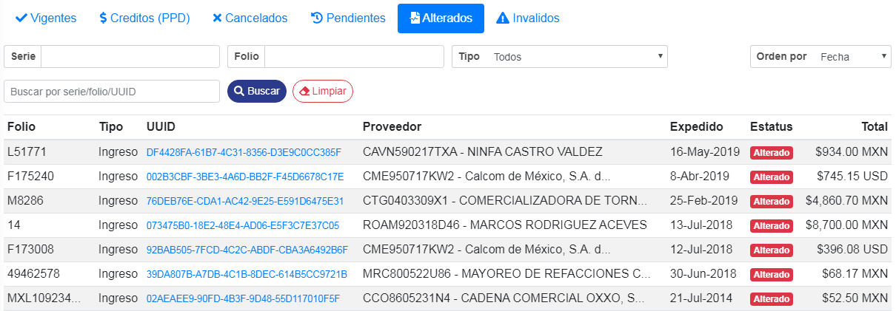

### ° Verificar estatus
Se podran ver todos los **CFDI alterados** de los proveedores en la tabla inferior, mostrando el estatus de alterados con un mensaje en rojo advirtiendo que dicha factura fue **alterada** y que no tiene validez fiscal ante el **SAT**.

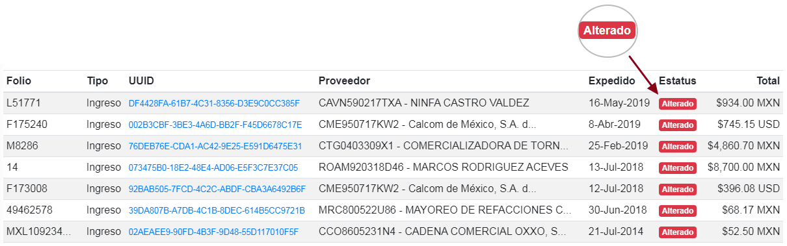

Se podra verificar la factura alterada si se presiona el **UUID** de dicha factura a verificar.

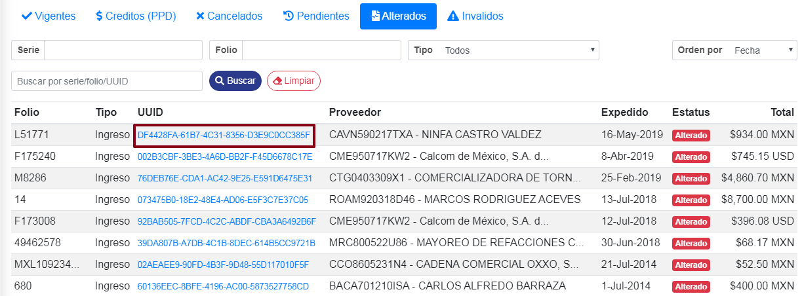

Se abrira una pestaña en donde se muestra el estatus de dicha factura, si la factua esta **alterada** no cargara el **PDF** y mostrar el siguiente mensaje: ***Este CFDI es considerado 'Alterado' por las siguienets razones: Error al Verificar Cadena y Sello: Sello Invalido: crypto/rsa: verification error***

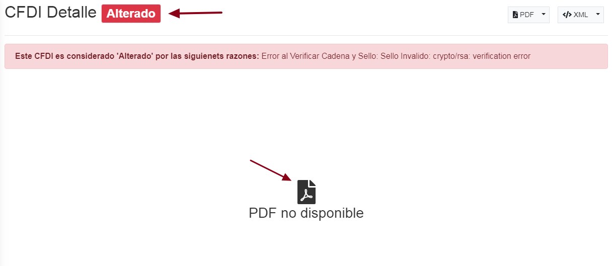

Para buscar cualquier factura alterada por su **Serie**, escribir la serie en el campo con 
dicho nombre y dar **clic** al boton de buscar.

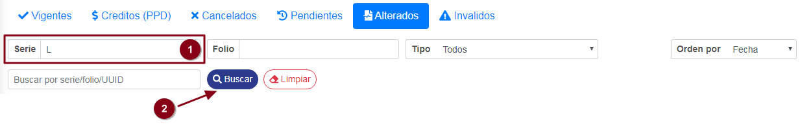

De esta manera buscar la **Factura** con dicha **serie**.

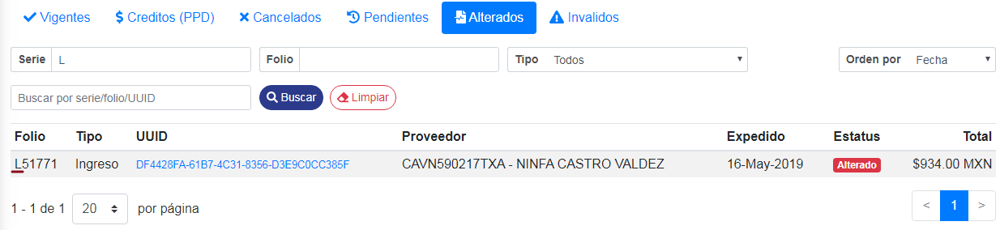

Para limpar la busqueda realizada anteriormente, dar **clic** al boton de **limpiar**.

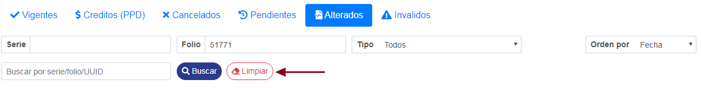

Para buscar cualquier factura alterada por su numero de **Folio**, escribir el folio en el campo con 
dicho nombre y dar **clic** al boton de buscar.

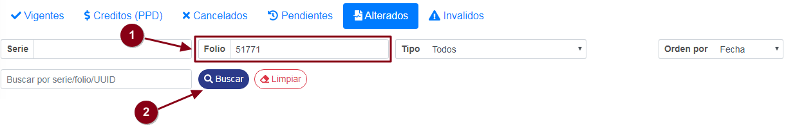

De esta manera buscar la **Factura** con dicho **folio**.

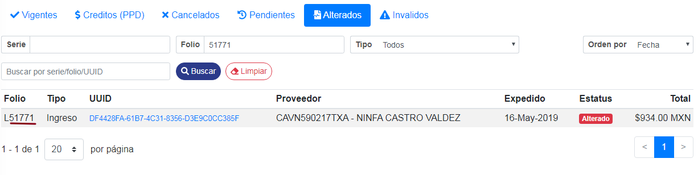

Para limpar la busqueda realizada anteriormente, dar **clic** al boton de **limpiar**.

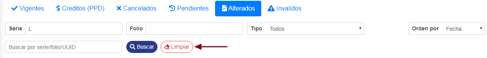

Tambien se podra realizar una busqueda de facturas a tiempo real, para ello escribir la **serie,folio o UUID** en el campo mostrado a continuación, de esa manera se realizara la busqueda a tiempo real. 

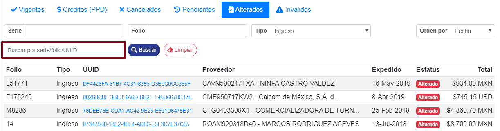

Para buscar por tipo de comprobante, dar **clic** al boton de **Tipo** y se desplegaran los tipos de comprobantes disponibles.

* **Todos**
* **Ingreso**
* **Egreso**
* **Translado**
* **Pago**
* **Nómina**

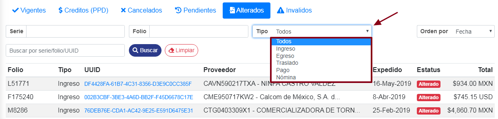

 Ya una vez seleccionado el tipo de comprobante, dar **clic** en el boton de buscar.

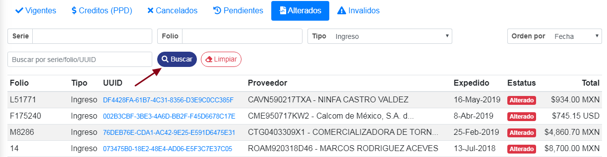

Para limpar la busqueda realizada anteriormente, dar **clic** al boton de **limpiar**.

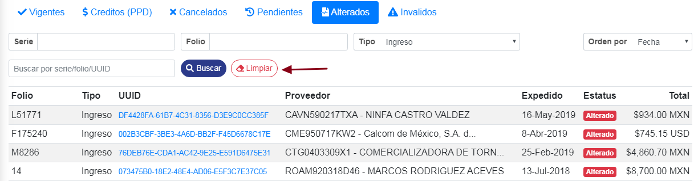

Se podran ordenar los resultados de los CFD's, ordenandolos por:

* Fecha
* Folio
* Total
* tipo

Para ordenar los **CFD's**, dar clic en el boton de **Orden por** y seleccionar el que sea de su necesidad.

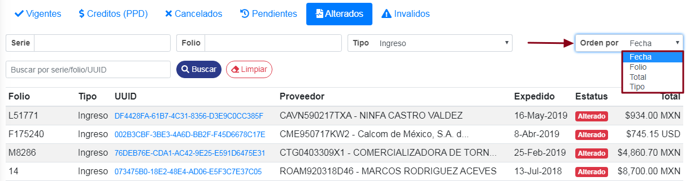
