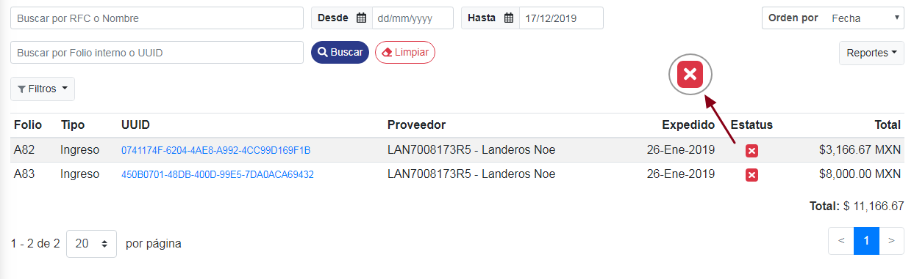

### ° Verificar estatus
Se podran ver todos los **CFDI cancelados** en la tabla inferior, mostrando el estatus de cancelación con una tacha color roja, indicando que estos fueron cancelados por el emiso de la **factura**.

### ° Acceder a CFD's
> **Se podra acceder a la información de los **CFD's** cancelados de dos distintas maneras, acontinuación se mostrara de la primera manera y despues se mostrara de la segunda manera.**

para acceder a las facturas de la primer manera, dar **clic** al **UUID** del CFDI a visualizar.

Se mostrara una ventana en donde se visualizaran los datos del **CFDI** seleccionado, mostrando el estado actual de la factura.

### ° Descargar CFD's
Se podra descargar el **CFDI** en formato *PDF* o *XML* dando **clic** en la pequeña flecha del boton que se desea ejecutar dicha descarga.

Para acceder a los **CFD's** de la segunda forma, pasar el curso por la factura a visualizar, al pasar el cursor por dicha factura aparecera dos iconos, uno es para visualizar en **PDF** y otro en **XML**

para abrir la factura en formato **PDF** dar **clic** al icono de **PDF**. Se abrira una ventana en donde se mostrara la factura en dicho formato. Para descargar la factura, dar **clic** al boton de descargar **PDF**.

> **Se podra salir de la ventana que se abrio anteriormente, presionando **ESC** en su teclado o dando un clic fuera de la ventana.**

para abrir la factura en formato **XML** dar **clic** al icono de **XML**. Se abrira una ventana en donde se mostrara la factura en dicho formato. Para descargar la factura, dar **clic** al boton de descargar **XML**.

> **Se podra salir de la ventana que se abrio anteriormente, presionando **ESC** en su teclado o dando un clic fuera de la ventana.**

Se podran buscar los CFD's validados ingresando el **RFC** o **Nombre del contribuyente** en los campos mencionados anteriormente y asi realizara la busqueda de manera automatica.

Tambien se podran buscar dichos CFD's ingresando el **Folio interno** o **UUID** en dichos campos anterirormete mencionados y asi realizara la busqueda de manera automatica.

Se podran realizar busquedas de **CFD's** mediante un rango de fechas, si desea realizar dicha busqueda selecciona la fecha inicial y la fecha final para realizar la busqueda de dichos **CFD's.**

Se podran ordenar los resultados de los **CFD's**, ordenandolos por:

* **Fecha**
* **Folio**
* **Total**  
* **tipo**

 Para ordenar los **CFD's**, dar **clic** en el boton de **Orden por** y seleccionar el que sea de su necesidad.

### ° Generar reportes
 Para generar reportes tales como:
* descargar relación de **CFD's** en formato **PDF**.
* descargar relación de **CFD's** en formato **XML**.
* descargar archivo **ZIP** con los **PDF** y **XML** de los **CFD's** de la consulta.
* Imprimir todos los **CFD's** en un solo **PDF** de multiples paginas.

Dar **clic** en el boton de **Reportes** y selccionar el reporte a generar.

### ° Filtros
Se podran realizar varios filtros de busqueda dándole **clic** al boton de **Filtros**

se abrira una pequeña ventana en donde se mostraran todo los filtros de busqueda disponibles, en el cual se podra elegir el o los filtros deseados.

> **NOTA: Para este ejemplo se elegio el filtro de: Metodo de pago: **PUE-pago en una sola exhibición** y el tipo que fuera de **Ingreso**.**
 
ya una vez seleccionado el o los filtros dar **clic** a **Aplicar filtros**.

Ya una vez aplicado el o los filtros seleccionados apareceran en la parte superior de la tabla indicando el o los **filtros utilizados.**

Para quitar el o algunos de los filtros seleccionados, dar **clic** al boton pequeño mostrado a continuación:

De esta manera el filtro seleccionado se abra quitado por lo tanto la busqueda relacionada a ese filtro tambien lo hará.