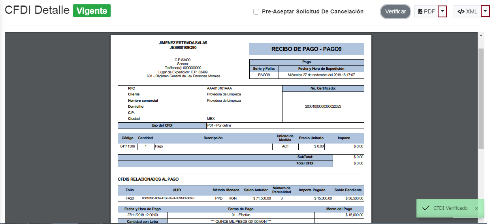
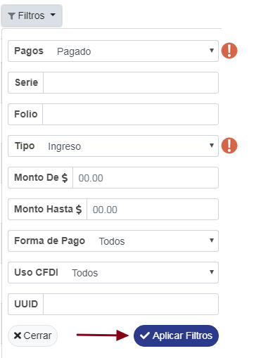
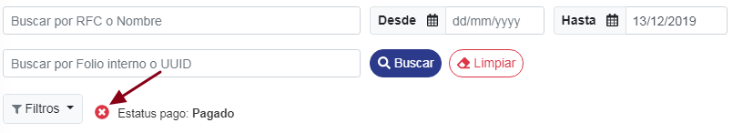

### ° Detalles de pagos
Se podra visualizar en la parte final de la tabla el campo de **Pagos**, que este indica si la factura ya esta pagada, aun le fantan pagos o no se a realizado ningun pago.

Para acceder a detalle al pago realizado, dar **clic** al **UUID** de la factura deseada.

En la parte inferior se mostrara un tabla en donde indicara a detalle todos los datos de pago de la **factura**

Se podra acceder al **recibo de pago** de cualquier pago raalizado dando **clic** al **UUID** de dicho pago.

Se mostrar los detalles del **recibo de pago**, en donde tambien se podra visualizar la vigencia de dicho recibo de pago.

### ° Pre-aceptar Solicitud de cancelación
Se podran realizar varias acciónes en la factura seleccionada tales como **Pre-aceptar Solicitud de cancelación** que se podra realizar seleccionando la casila con dicho nombre. 
Al reazalir dicha acción se mostrar un mensaje avisando que el **CFDI** recibido ya fue cambiado a pre-aceptación.

### ° Verificar vigencia
Se puede verificar al instante si tu **CFDI** se encuentra vigente o cancelado dando clic en el boton de **verificar** y asi te mostrar un aviso si dicho **CFDI** esta verificado.

### ° Descargar CFD's
Se podra descargar el **CFDI** en formato *PDF* o *XML* dando **clic** en la pequeña flecha del boton que se desea ejecutar dicha descarga.

Se podran buscar los **CFD's** ingresando el **RFC** o **Nombre del contribuyente** en los campos mencionados anteriormente y asi realizara la busqueda de manera automatica.

Tambien se podran buscar dichos CFD's ingresando el **Folio interno** o **UUID** en dichos campos anterirormete mencionados y asi realizara la busqueda de manera automatica.

Se podran realizar busquedas de **CFD's** mediante un rango de fechas, si desea realizar dicha busqueda selecciona la fecha inicial y la fecha final para realizar la busqueda de dichos **CFD's.**

Se podran ordenar los resultados de los **CFD's**, ordenandolos por:

* Fecha
* Folio
* Total  
* tipo

 Para ordenar los **CFD's**, dar **clic** en el boton de **Orden por** y seleccionar el que sea de su necesidad.

### ° Generar reportes
 Para generar reportes tales como:
* descargar relación de **CFD's** en formato **PDF**.
* descargar relación de **CFD's** en formato **XML**.
* descargar archivo **ZIP** con los **PDF** y **XML** de los **CFD's** de la consulta.
* Imprimir todos los **CFD's** en un solo **PDF** de multiples paginas.

Dar **clic** en el boton de **Reportes** y selccionar el reporte a generar.

### ° Filtros
Se podran realizar varios filtros de busqueda dandole **clic** al boton de **Filtros**

se abrira una pequeña ventana en donde se mostraran todo los filtros de busqueda disponibles, en el cual se podra elegir el o los filtros deseados.

> NOTA: Para este ejemplo se elegio el filtro de: Metodo de pago: **Pagado** y el tipo que fuera de **Ingreso**.
 
ya una vez seleccionado el o los filtros dar **clic** a **Aplicar filtros**.

Ya una vez aplicado el o los filtros seleccionados apareceran en la parte superior de la tabla indicando el o los **filtros utilizados.**

Para quitar el o algunos de los filtros seleccionados, dar **clic** al boton pequeño mostrado a continuación:

De esta manera el filtro seleccionado se abra quitado por lo tanto la busqueda relacionada a ese filtro tambien lo hará.