### ° Verificar estatus
Se podran ver todos los **CFDI invalidos** de los proveedores en la tabla inferior, mostrando el estatus de invalidez con un mensaje en color amarillo advirtiendo que dicha factura tiene un estado de **invalidez fiscal** ante el **SAT**.

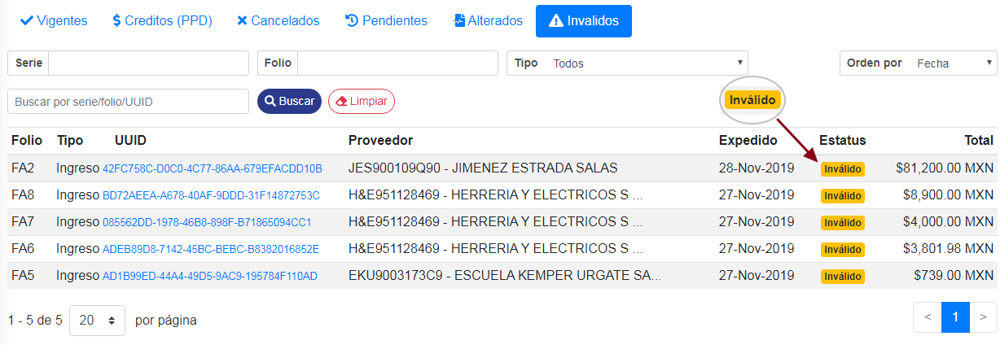

### ° Acceder a CFD's
> **Se podra acceder a la información de los **CFD's** de dos distintas maneras, acontinuación se mostrara de la primera manera y más adelante se mostrara de la segunda manera.**

Para acceder a las facturas de la primer manera, dar **clic** al **UUID** del CFDI a visualizar.

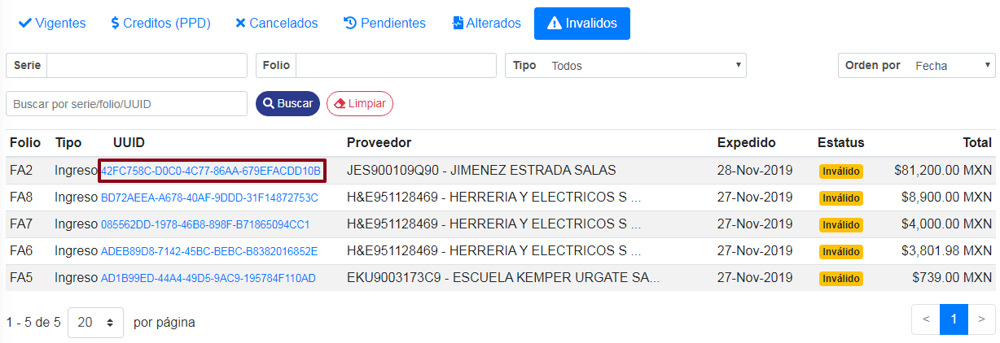

Se mostrara una ventana en donde se visualizaran los datos del **CFDI** seleccionado, mostrando el estado actual de la factura.

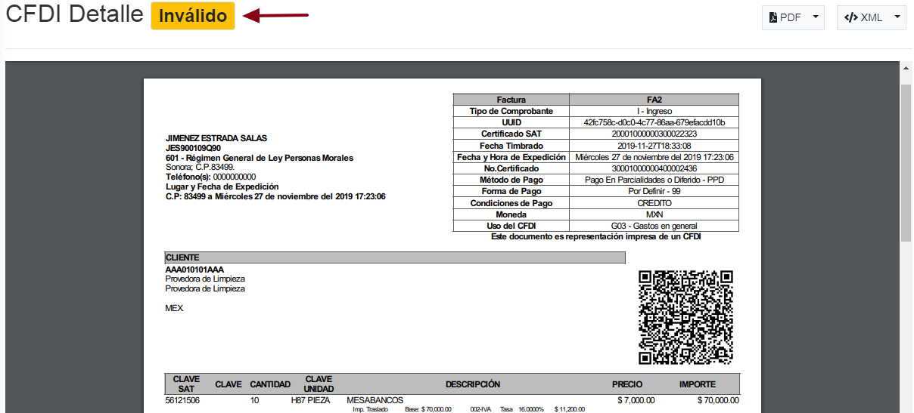

### ° Descargar CFD's
Se podra descargar el **CFDI** en formato *PDF* o *XML* dando **clic** en la pequeña flecha del boton que se desea ejecutar dicha descarga.

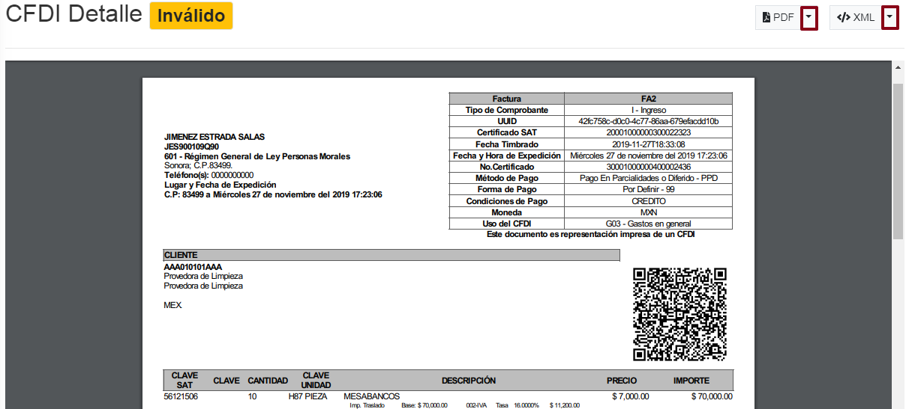

### °Acceder de manera rapida a los CFD's

Para acceder a los **CFD's** de la segunda forma, pasar el curso por la factura a visualizar, al pasar el cursor por dicha factura aparecera dos iconos, uno es para visualizar en **PDF** y otro en **XML**

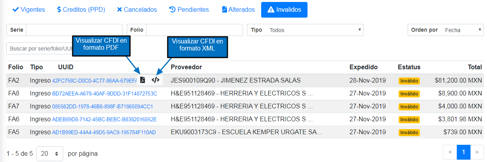

para abrir la factura en formato **PDF** dar **clic** al icono de **PDF**. Se abrira una ventana en donde se mostrara la factura en dicho formato. Para descargar la factura, dar **clic** al boton de Descargar **PDF**.

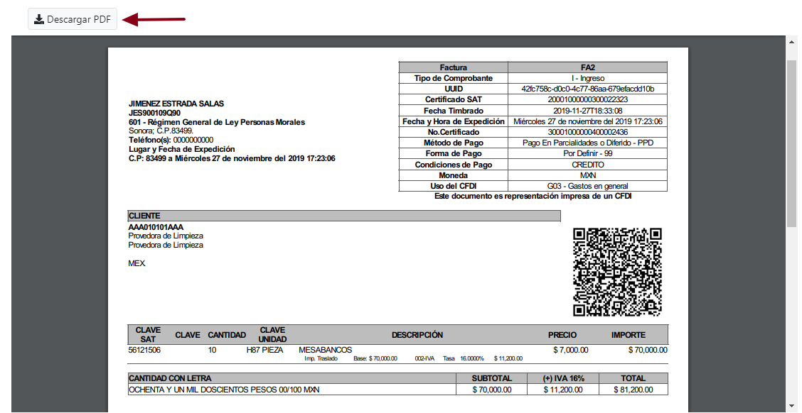

> **Se podra salir de la ventana que se abrio anteriormente, presionando **ESC** en su teclado o dando un clic fuera de la ventana.**

para abrir la factura en formato **XML** dar **clic** al icono de **XML**. Se abrira una ventana en donde se mostrara la factura en dicho formato. Para descargar la factura, dar **clic** al boton de Descargar **XML**.

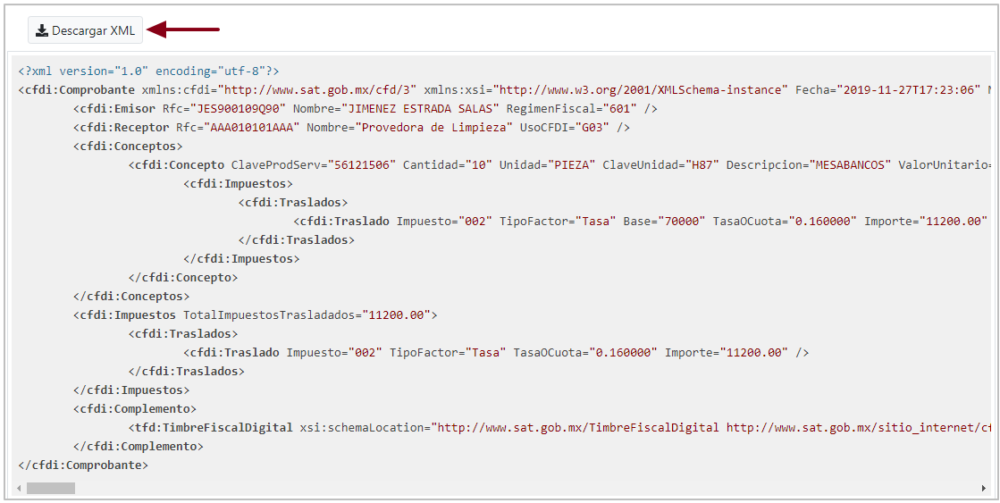

> **Se podra salir de la ventana que se abrio anteriormente, presionando **ESC** en su teclado o dando un clic fuera de la ventana.**

### ° Busquedas de CFD's

Para buscar cualquier factura invalida por su **Serie**, escribir la serie en el campo con 
dicho nombre y dar **clic** al boton de buscar.

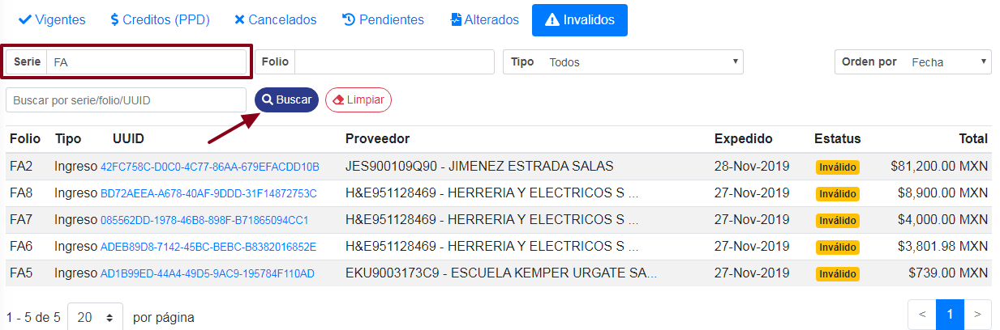

De esta manera se buscara la **Factura** con dicha **serie**.

Para limpar la busqueda realizada anteriormente, dar **clic** al boton de **limpiar**.

Para buscar cualquier factura alterada por su numero de **Folio**, escribir el folio en el campo con 
dicho nombre y dar **clic** al boton de buscar.

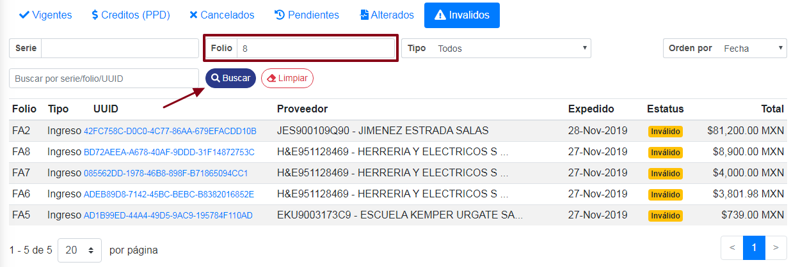

De esta manera buscar la **Factura** con dicho **folio**.

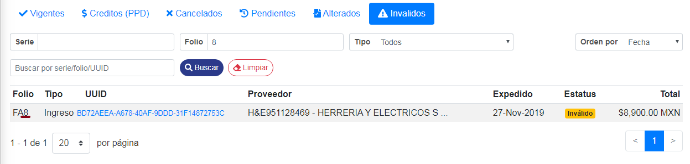

Para limpar la busqueda realizada anteriormente, dar **clic** al boton de **limpiar**.

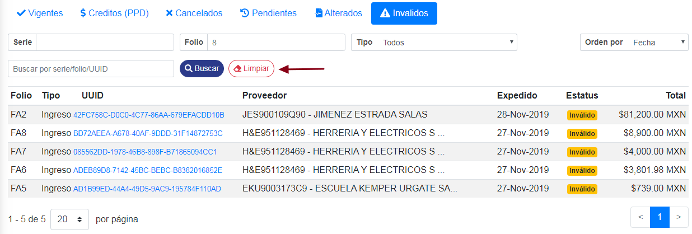

Tambien se podra realizar una busqueda de facturas a tiempo real, para ello escribir la **serie,folio o UUID** en el campo mostrado a continuación. De esa manera se realizara la busqueda a tiempo real. 

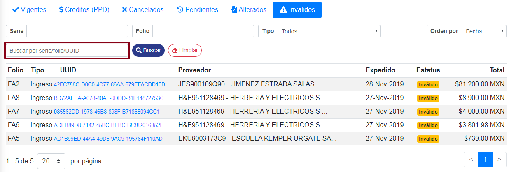

Para buscar por tipo de comprobante, dar **clic** al boton de **Tipo** y se desplegaran los tipos de comprobantes disponibles.

* **Todos**
* **Ingreso**
* **Egreso**
* **Translado**
* **Pago**
* **Nómina**

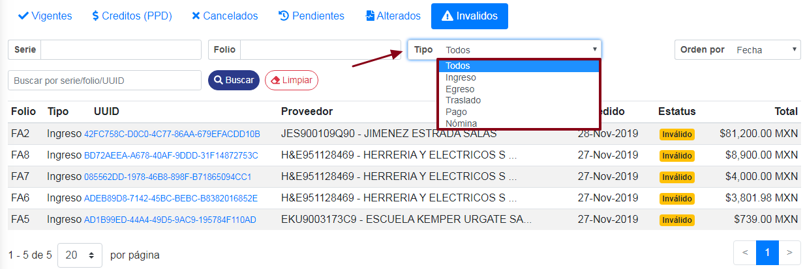

 Ya una vez seleccionado el tipo de comprobante, dar **clic** en el boton de buscar.

Para limpar la busqueda realizada anteriormente, dar **clic** al boton de **limpiar**.

Se podran ordenar los resultados de los CFD's, ordenandolos por:

* **Fecha**
* **Folio**
* **Total**
* **tipo**

Para ordenar los **CFD's**, dar clic en el boton de **Orden por** & seleccionar el que sea de su necesidad.

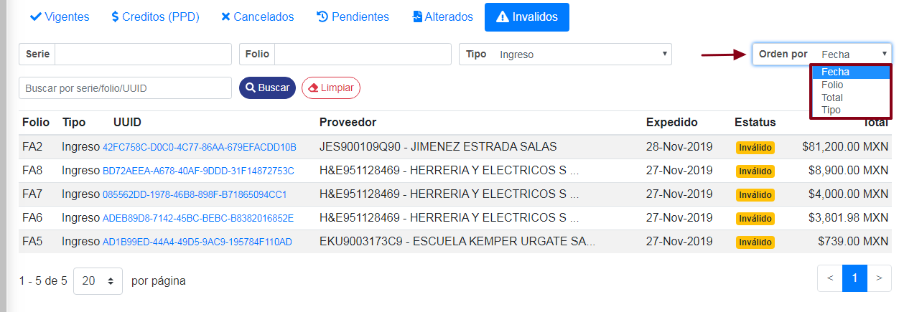

