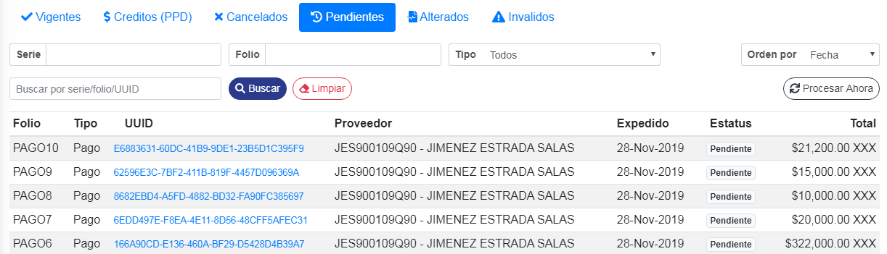

### ° Verificar estatus 
Se podran ver todos los **CFDI** pendientes en la tabla inferior, mostrando el estatus de estado **pendiente**, indicando que las facturas estan en proceso de validación ante el **SAT**.

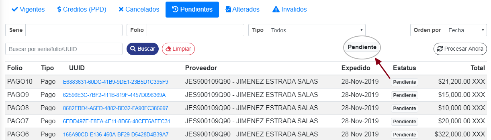

### ° Adelantar Proceso 

> **NOTA:** **Los CFD's tardaran aproximandamente 30 minutos en se valide la integridad y la validez fiscal de dichos comprobantes. Por lo tanto, tardara dicho tiempo en asignarle su estatus correspondiente.**

Para adelantar dicho proceso y no tener que esperar los 30 minutos, dar **clic** al boton de **Procesar Ahora**. 

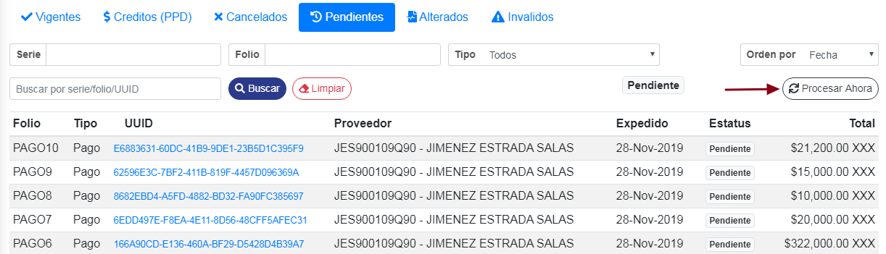

De esta manera **se validara la integridad y la validez fiscal** de dichos comprobantes **de inmediato.**

### ° Acceder a CFD's
> **Se podra acceder a la información de los **CFD's** de dos distintas maneras, acontinuación se mostrara de la primera manera y despues se mostrara de la segunda manera.**

Para acceder a las facturas de la primer manera, dar **clic** al **UUID** del CFDI a visualizar.

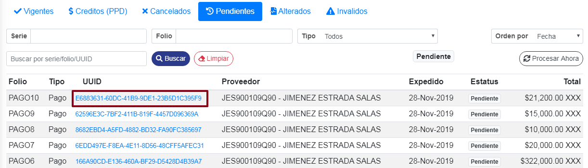

Se mostrara una ventana en donde se visualizaran los datos del **CFDI** seleccionado, mostrando su estado actual.

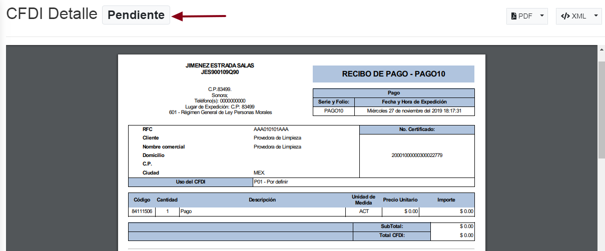

### ° Descargar CFD's
Se podra descargar el **CFDI** en formato *PDF* o *XML* dando **clic** en la pequeña flecha del boton que se desea ejecutar dicha descarga.

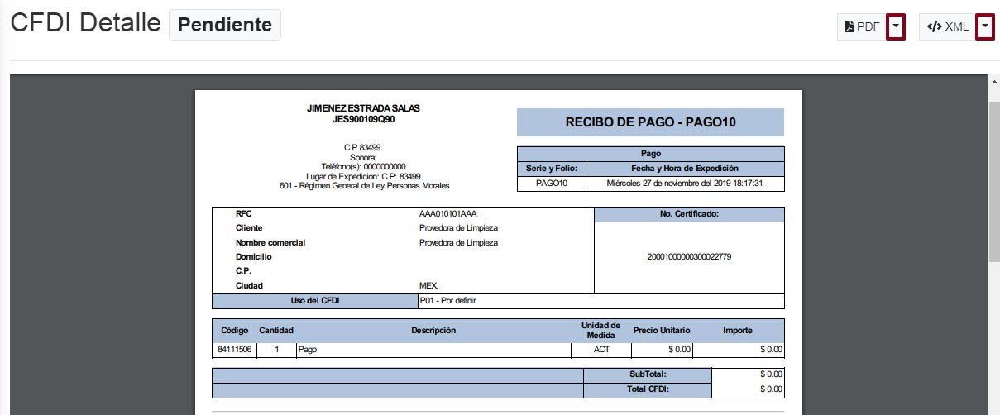

### ° Acceder de manera rapida a los CFD's

Para acceder a los **CFD's** de la segunda forma, pasar el curso por la factura a visualizar, al pasar el cursor por dicha factura aparecera dos iconos, uno es para visualizar en **PDF** y otro en **XML**

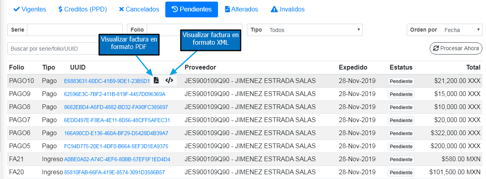

para abrir la factura en formato **PDF** dar **clic** al icono de **PDF**. Se abrira una ventana en donde se mostrara la factura en dicho formato. Para descargar la factura, dar **clic** al boton de descargar **PDF**.

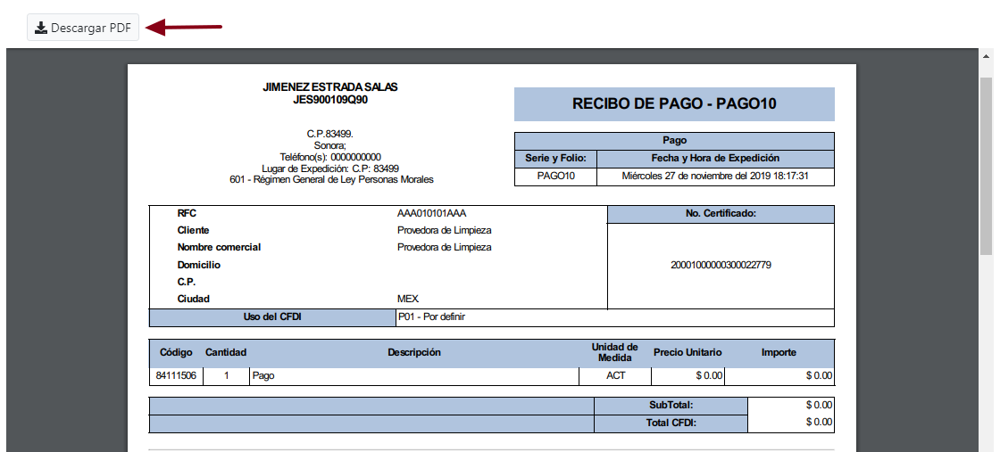

> **Se podra salir de la ventana que se abrio anteriormente, presionando **ESC** en su teclado o dando un clic fuera de la ventana.**

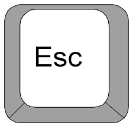

para abrir la factura en formato **XML** dar **clic** al icono de **XML**. Se abrira una ventana en donde se mostrara la factura en dicho formato. Para descargar la factura, dar **clic** al boton de descargar **XML**.

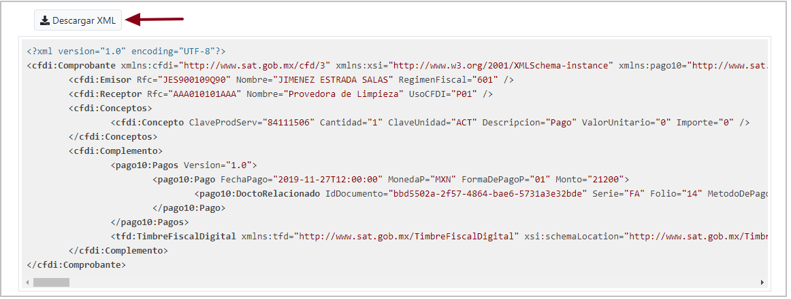

> **Se podra salir de la ventana que se abrio anteriormente, presionando **ESC** en su teclado o dando un clic fuera de la ventana.**

### ° Busquedas de CFD's

Para buscar cualquier factura pendiente por su **Serie**, escribir la serie en el campo con 
dicho nombre y dar **clic** al boton de buscar.

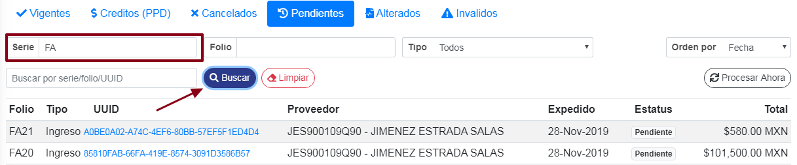

De esta manera se buscara la **Factura** con dicha **serie**.

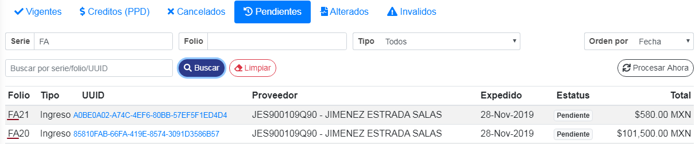

Para limpar la busqueda realizada anteriormente, dar **clic** al boton de **limpiar**.

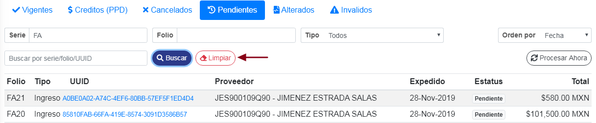

Para buscar cualquier factura pendiente por su numero de **Folio**, escribir el folio en el campo con 
dicho nombre y dar **clic** al boton de buscar.

De esta manera buscar la **Factura** con dicho **folio**.

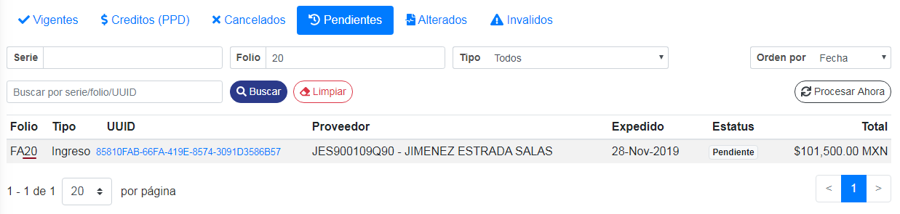

Para limpar la busqueda realizada anteriormente, dar **clic** al boton de **limpiar**.

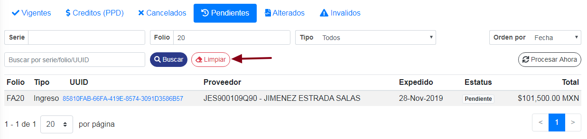

Tambien se podra realizar una busqueda de facturas a tiempo real, para ello escribir la **serie,folio o UUID** en el campo mostrado a continuación. De esa manera se realizara la busqueda a tiempo real. 

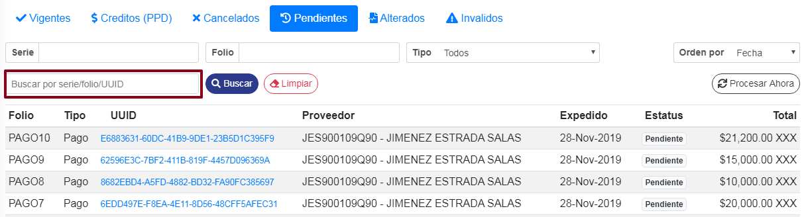

Se podran ordenar los resultados de los CFD's, ordenandolos por:

* **Fecha**
* **Folio**
* **Total**
* **tipo**

Para ordenar los **CFD's**, dar clic en el boton de **Orden por** y seleccionar el que sea de su necesidad.

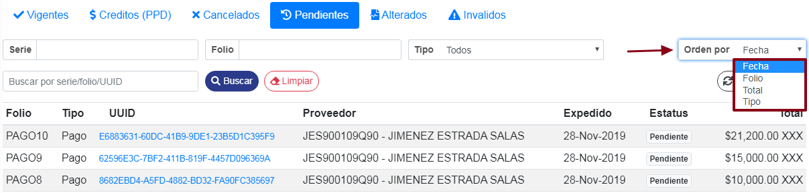
