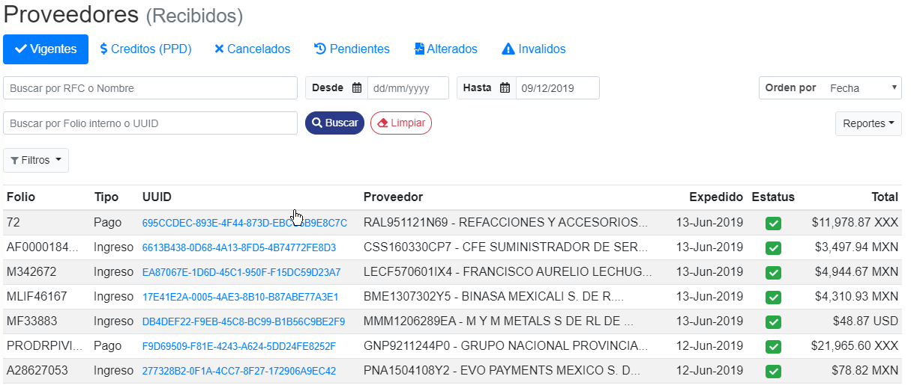
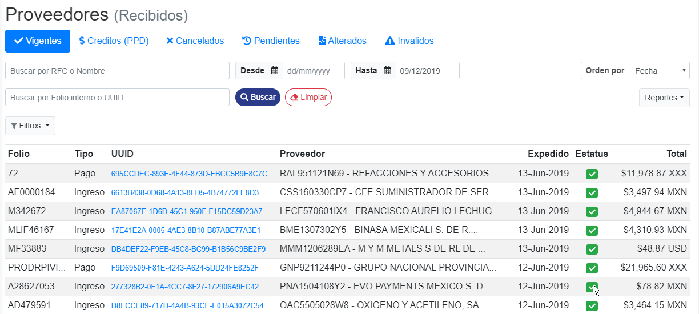

Se podran ver todos los **CFDI vigentes** de los proveedores en la tabla inferior, mostrando el estatus de validación con una palomita verde, indicando que ya fueron aceptados por el **SAT**.

Se podran buscar los CFD'S validados ingresando el **RFC** o **Nombre del contribuyente** en el campo mostrado a continuación.

Se podran buscar dichos CFD'S ingresando el **Folio interno** o **UUID** en el campo mostrado a continuación.

