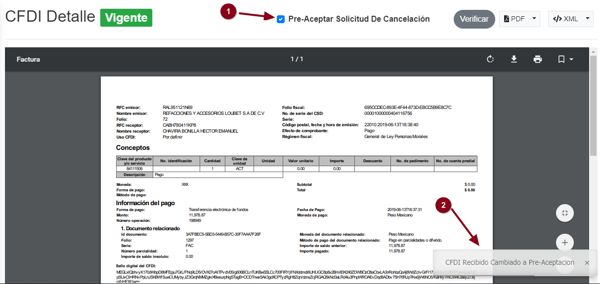
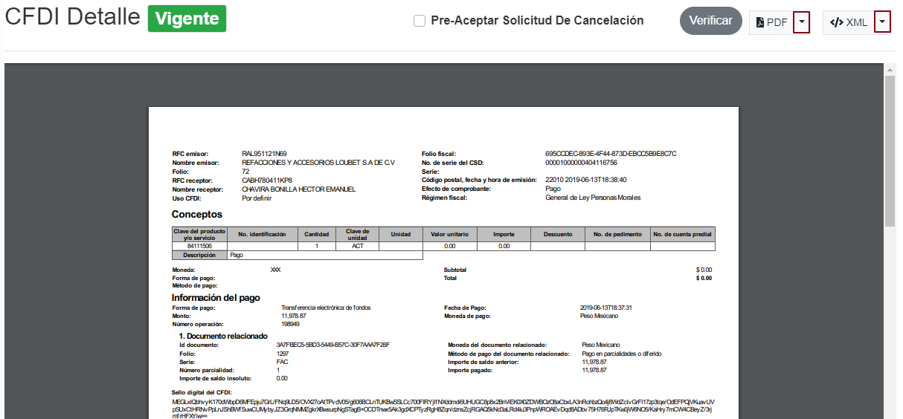

Se podran ver todos los **CFDI vigentes** de los proveedores en la tabla inferior, mostrando el estatus de validación con una palomita verde, indicando que ya fueron aceptados por el **SAT**.

Se podra acceder a la información de los **CFD's** dando **clic** al **UUID** del CFDI a visualizar.

Se mostrara una ventana en donde se mostraran los datos del **CFDI** seleccionado.

Se podran realizar varias acciónes en la factura seleccionada tales como **Pre-aceptar Solicitud de cancelación** que se podra realizar seleccionando la casila con dicho nombre. 
Al reazalir dicha acción se mostrar un mensaje avisando que el **CFDI** recibido ya fue cambiado a pre-aceptación.

Se puede verificar al instante si tu **CFDI** se encuentra vigente o cancelado dando clic en el boton de **verificar** y asi te mostrar un aviso si dicho **CFDI** esta verificado.

Se podran descargar el **CFDI** en formato *PDF* o *XML* dando **clic** en el boton que se desea ejecutar dicha descarga.

Se podran buscar los CFD's validados ingresando el **RFC** o **Nombre del contribuyente** en los campos mencionados anteriormente y asi realizara la busqueda de manera automatica.

Se podran buscar dichos CFD's ingresando el **Folio interno** o **UUID** en dichos campos anterirormete mencionados y asi realizara la busqueda de manera automatica.

Se podran realizar busquedas de **CFD's** mediante un rango de fechas, si desea realizar dicha busqueda selecciona la fecha inicial y la fecha final para realizar la busqueda de dichos **CFD's.**

Se podran ordenar los resultados de los **CFD's**, ordenandolos por:

* Fecha
* Folio
* Total  
* tipo

 Para ordenar los **CFD's** dar **clic** en el boton de **Orden por** y seleccionar el que sea de su necesidad.

