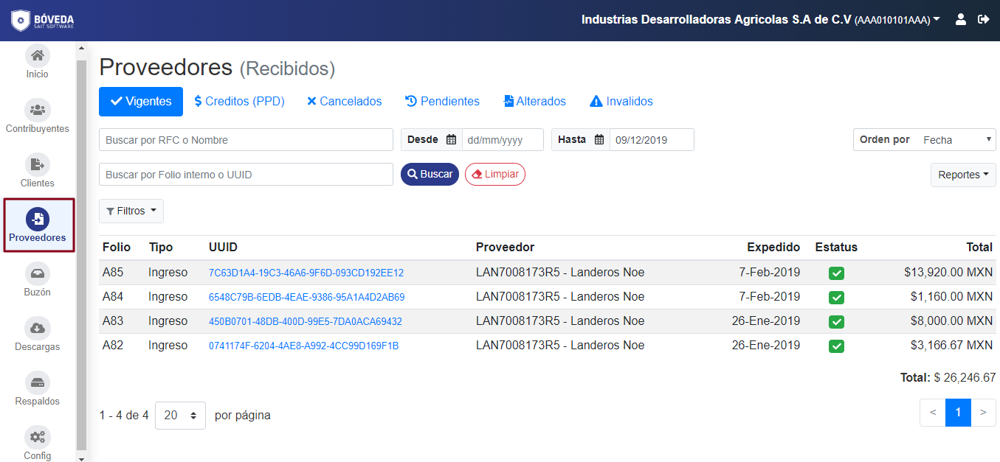

>**NOTA:**  Los catálogos de Clientes (Emitidos) y Proveedores (Recibidos) son iguales, por lo que en este ejemplo se explica sólo el de Provedores (Recibidos).

Para acceder a la sección **Provedores** de **SAIT bóveda** dar clic en el ícono de **Provedores**.

>Siga los enlaces para entrar en detalle con la sección de **Provedores**.

