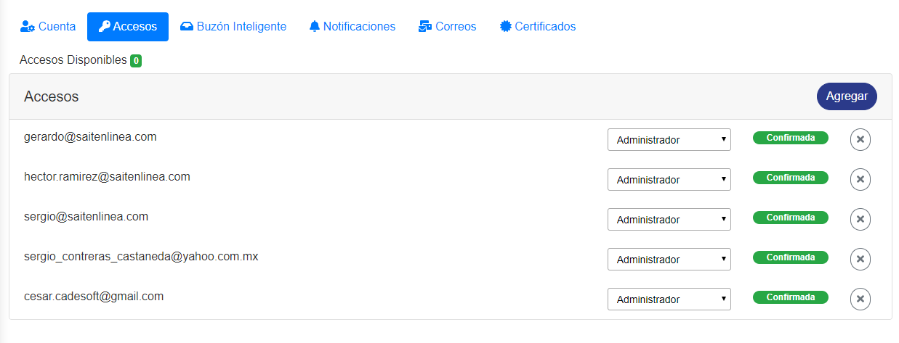
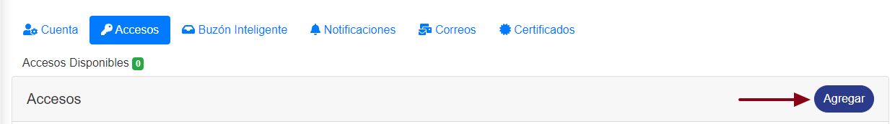
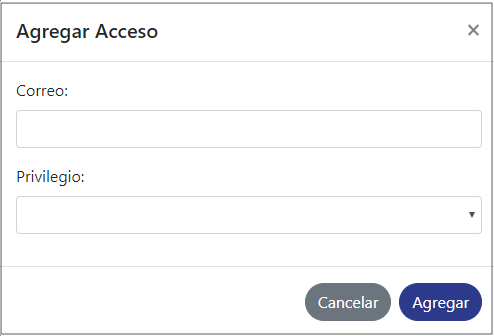
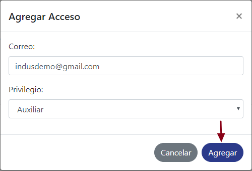
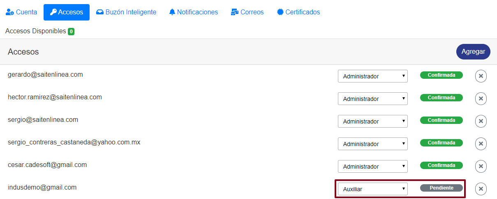
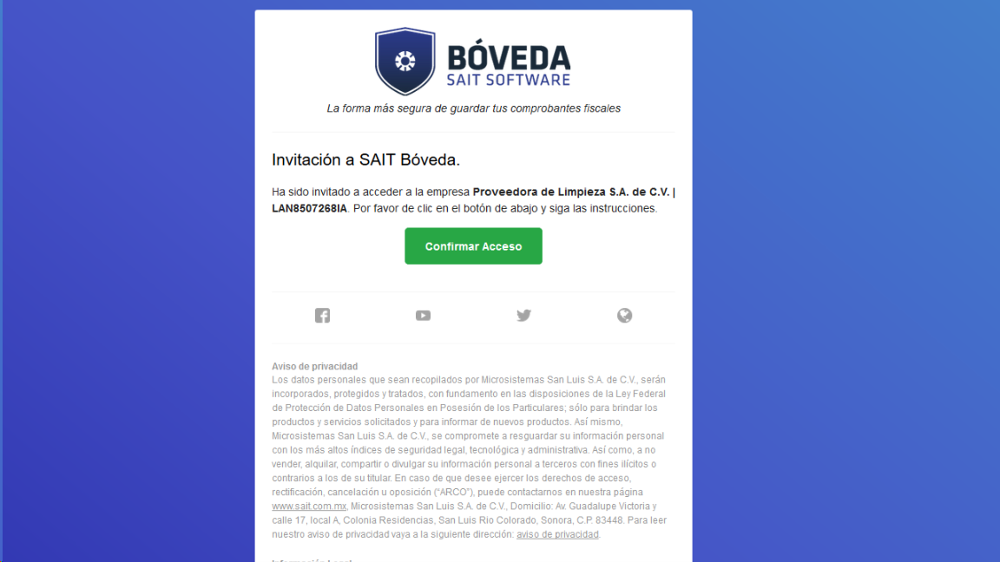
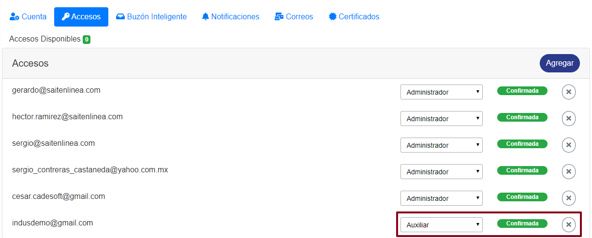

Esta acción registra el acceso que tendra un usario dentro de **SAIT Bóveda** para **ver o modificar la información de una empresa**, en caso de tener varias empresas debe registrar el usuario en cada empresa que quiera que tenga acceso. 

 
### ° Asignar nivel de acceso
Para asignar un nivel de acceso a un usuario dar **clic** en agregar. 

### ° Elegir acceso

Se abrirá una ventana en donde se deverá de ingresar el correo del usuario y el nivel de privilegios que tendrá dentro de **SAIT Bóveda**.

 

### ° Tipos de accesos

*	**Administrador**:
 Acceso a todo.
*	**Auxiliar**: 
	* No descarga ZIP.
	* No descarga SAT.
	* No agregar-modificar Reglas de cancelación.
	* No Modificar configuración.
	* No Agregar-modificar accesos.
	* No agregar-modificar correos sync.

### ° Agregar acceso
Ya una vez rellenado el **email** y el **privilegio** que tendra el ususario darle clic en **agregar**

Quedara registrado con un estatus de **PENDIENTE**.

 

### ° Confirmar acceso

El usuario recibirá un correo como la imagen mostrada acontinuación, en su bandeja de entrada para confirmar su cuenta.

 

Al confirmar su cuenta el estatus de la cuenta del usuario cambia a **Confirmada**.

 
