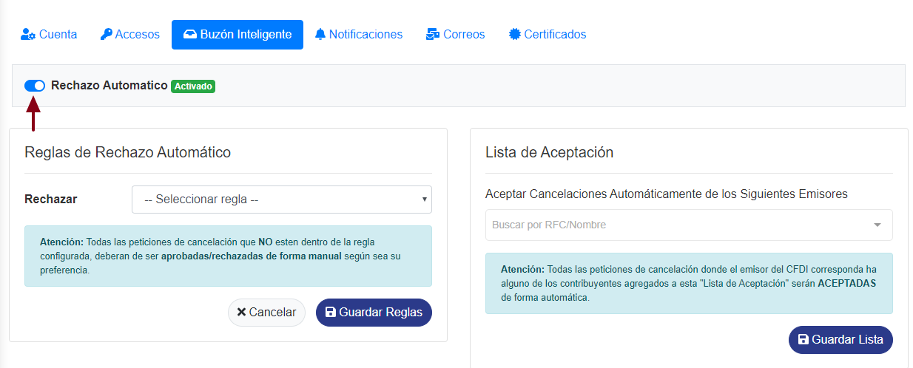
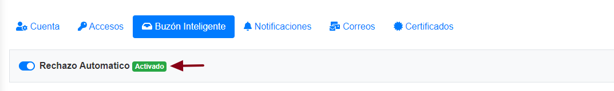
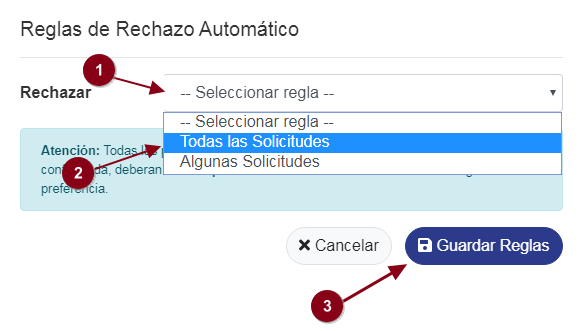
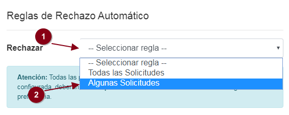
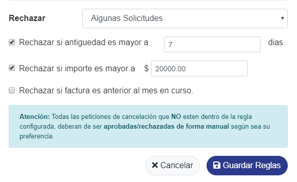
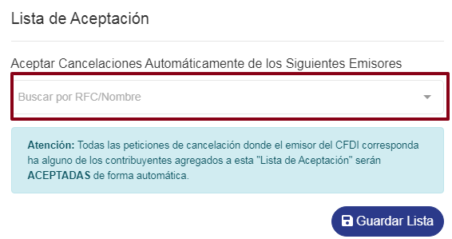
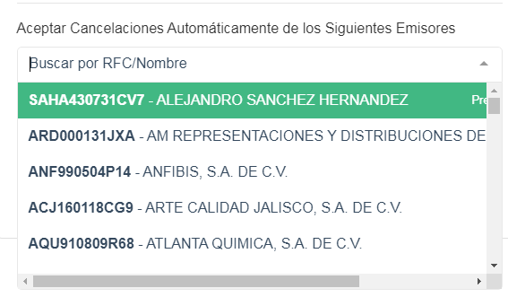
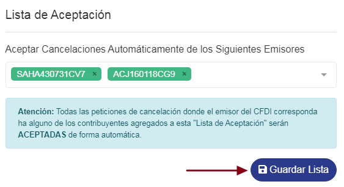
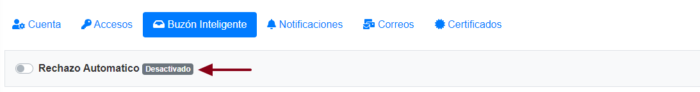

### ° Rechazo automático

* En este switch de **Rechazo automático** Activamos o desactivamos el buzón inteligente, Este tendra diferentes funcionalidades dependiendo si esa activado o descativado.

### ° Estado activo de buzón inteligente

* **Activado**:
  

* Se Rechaza de forma automática los CFDI's que lleguen al buzón siguiendo las reglas.
	*	Rechazar con antigüedad en ## días .
	*	Rechazar todo antes del mes actual .
	*	Rechazar por monto mayor a $ ###,###.##.
	*	Rechazar todas las solicitudes.
	*	Aceptar todas donde el emisor esté en lista blanca.
  
*	Se envía correo a contacto de bóveda notificando la acción & acuse.
*	Si, no entra a ninguna regla se acepta automático
*	Cuando se rechaza, se puede marcar como pre-aprobada de manera manual.
* Las solicitudes posterior a un rechazo:
	*	Si se encuentra pre-aprobada, se acepta la cancelación de forma automática.
 	*	Si no se encuentra pre-aprobada se vuelve a rechazar
	*	Se envía correo a contacto de bóveda notificando la acción & acuse.
    
*	En catálogo o listado de buzón se muestran por defecto las solicitudes procesadas ya sean aceptadas o rechazadas.

### ° Reglas de rechazo automático
con esta sección Podemos rechazar todas las solicitudes o rechazar solo algunas.
Para recharzar todas dar **clic** al boton de **--Seleccionar regla--** y seleccionar **todas las solicitudes**
y por ultimo dar **clic** al boton de **Guardar reglas**.

 

O podemos establecer **reglas que rechazaran los CFDI's** que cumplan esos requisitos, los CFDI's que no cumplan podemos verlos en el buzón inteligente, para ello dar clic al bonton de **--Seleccionar regla--** y seleccionar **Algunas Solicitudes**.

 

Se mostra un menú en donde se podra elegir **Las reglas que rechazaran los CFDI's** , ya una vez elegindas dar **clic** al boton de **Guardar reglas**.

 

### ° Lista de aceptación
Por ultimo podemos **establecer una lista de RFC's de emisores** a los cuales siempre aceptaremos sus solicitudes de cancelación.
Para ello nos dirigiremos a la sección de **Lista de Aceptación** y dar un **clic** al campo de **Buscar por RFC/Nombre**.

 

Se mostran en una lista todos los **emisores** en donde se podran seleccionar los **RFC's** de emisores deseados.

 

Ya una vez seleccionado el o los **RFC's** de los emisores, dar **clic** al boton de **Guardar Lista**

 

    

### ° Estado inactivo del buzón inteligente
* **Desactivado**:
 

*	Solicitudes esperan aceptación o rechazo de forma manual
*	Se envía correo a contacto de bóveda notificando la solicitud de cancelación (El correo contendrá dos link únicos uno para aceptación y otro para rechazó con un api key temporal única, para no tener que ingresar a sitio de bóveda)
*	Se envía correo a contacto de bóveda notificando la acción & acuse.

	*	Si no se recibe acción manual, el SAT aplica las reglas previamente establecidas en DOF.
	*	Se envía correo a contacto de bóveda notificando el estatus cancelación de su solicitud no atendida. 
	*	En el catálogo o listado de buzón se muestran por defecto las solicitudes pendientes de aceptación-rechazo.

