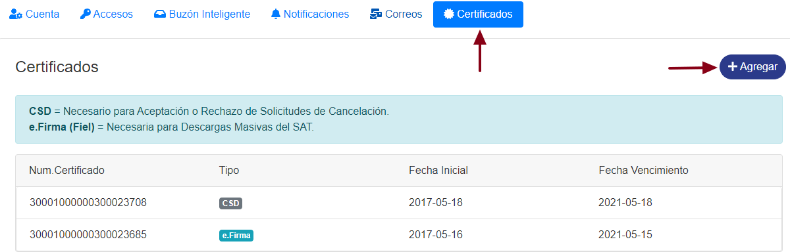
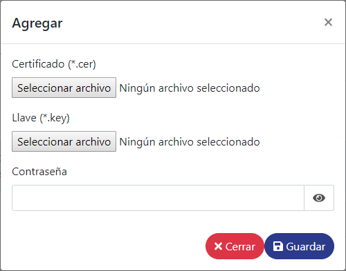
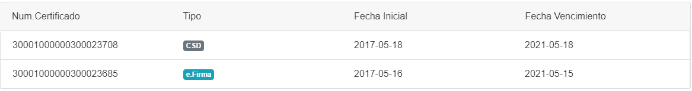

**Certificados**:

*	**CSD**: Se usara para el funcionamiento del buzón inteligente, con este sello recibiremos las solicitudes de cancelación.
*	**e.Firma (FIEL)**: Se usara para hacer las solicitudes de descarga de comprobantes.

##### ° Registrar certificados.

*	Dirigirse a la sección **Certificados** y haga clic en **agregar**.

 

*	En la ventana agregue los archivos que se solicitan y la contraseña del certificado.

*	Listo! el certificado ha sido registrado.

