#### ° Registro de correos.

Dirígase a la seccion de correos y de clic en el boton agregar 

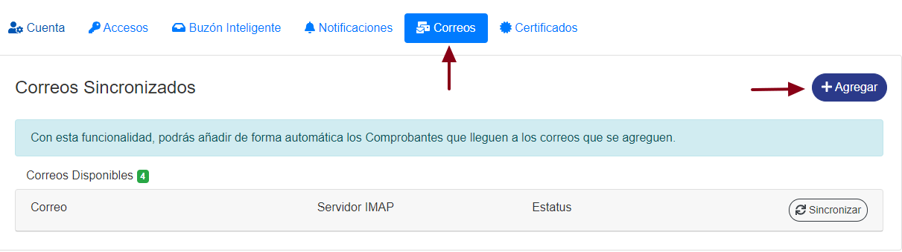

Aparecera una ventana donde debe colocar la **información de su cuenta de correo electronico.**

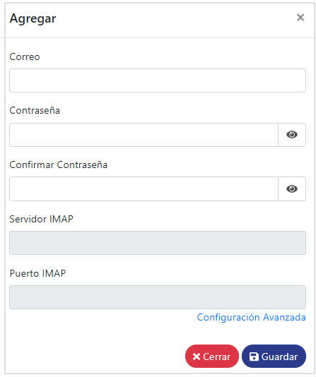

Es necesario que coloque tambien la URL del **servidor IMAP** y el **puerto IMAP**, estos varian dependiendo de su proveedor de correo electronico.
    

> **NOTA!!!** En caso de usar Gmail se usan estos datos: 
> **Servidor IMAP:** imap.gmail.com	 
> **Puerto IMAP:** 993

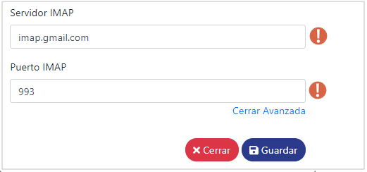

Ya una vez completa la información requerida dar **clic** en el boton de **Guardar**

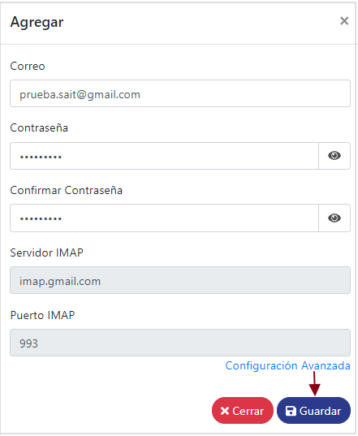

Despues de comprobar las credenciales el correo aparecera registrado en la tabla de correos y 
**se empezaran a recibir los CFDIs en el Buzon.**

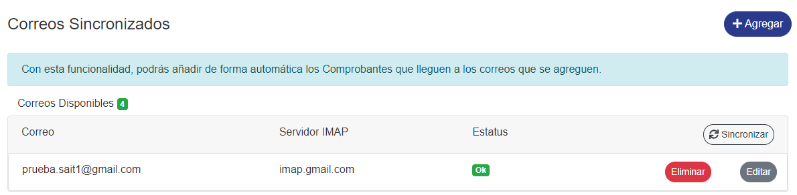

#### ° Sincronización.
> **NOTA!!!** Los Comprobantes que lleguen a los correos tardaran 
> **30 minutos** en mostrarse , si desea que los comprobantes se muestren de inmediato dar clic al  boton de **Sincronizar** para que dichos comprobantes **se muenstren al instante.**

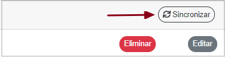

#### ° Modificación de correos.

Para modificar algun correo registrado dar **clic** en el boton de **Editar** de dicho correo.

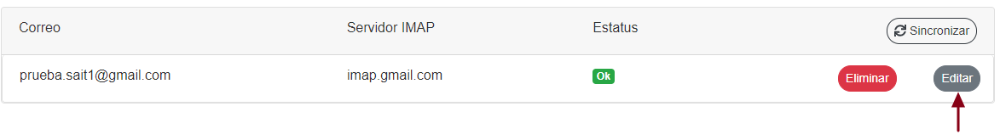

Se abrira una ventana donde se monstraran los datos del correo seleccionado.

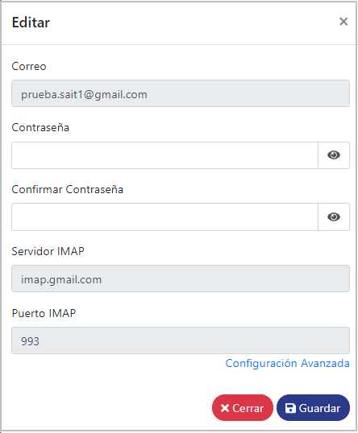

Para modificar los campo de **Servidor IMAP** y **Puerto IMAP** se tendra que activar la **Configuración avanzada** , para ello dar clic en el enlace de
Configuración avanzada, de esta manera de habilitaran los campos para poder **modificarlos**.

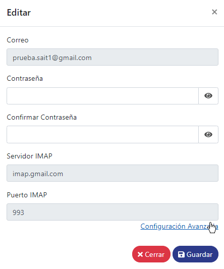

#### ° Eliminación de correos.
Para eliminar algun correo registrado dar **clic** en el boton de **Eliminar** de dicho correo.
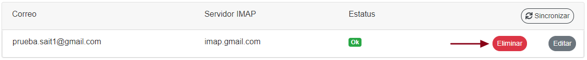

Se abrira una ventana de confirmación a la cual se le tendra que dar clic en el boton de **Confirmar** para eliminar dicho correo electrinico registrado.

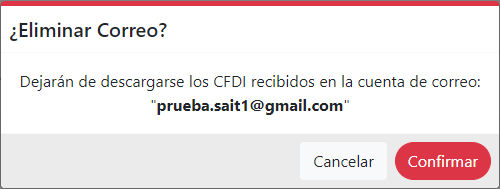

De esta manera el correo **quedara eliminado.**
