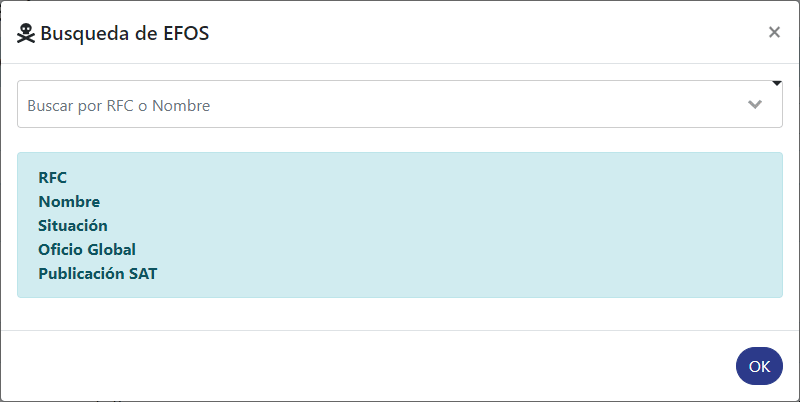
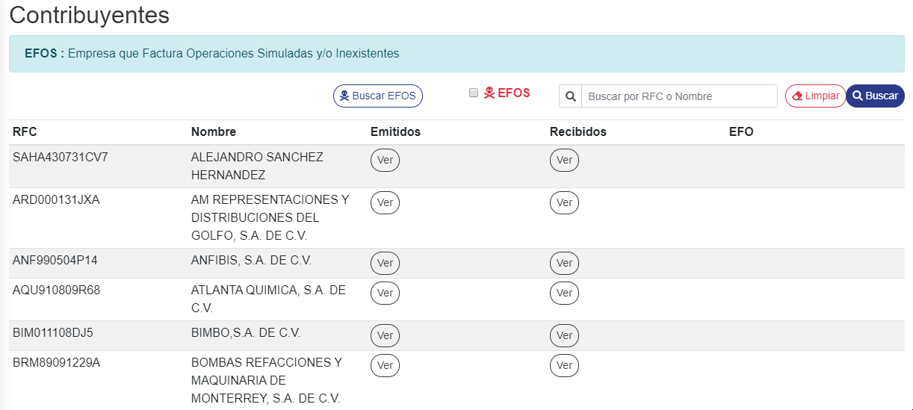

Para acceder a la sección **Contribuyente** de **SAIT bóveda** dar clic en el ícono de **Contribuyente**.

En esta sección se monstraran todos los datos tanto de **clientes** como **provedores** que se encuentran dentro de su cuenta de **SAIT Bóveda.**

#### ° Buscar contribuyente
Para buscar algun contribuyente en especifico, dirigirse al campo de busqueda y escribir su **RFC** o su **nombre del contribuyente**, de esta manera se **buscara su contribuyente** en tiempo real.

#### ° Ver CFD'S emitidos o resividos
Para ver los **CFD'S** emitidos o recibidos de algun contribuyente, dar clic en el boton **ver** en el campo de **emitidos** si se desea ver los **CFD'S** emitidos al cliente o **recibidos** si se desea ver los **CFD'S** recibidos al cliente de dicho contribuyente.

#### ° Buscar EFO'S del SAT

la sección de contribuyente cuenta con busqueda de **EFOS** de manera que podras buscar si alguno de tus contribuyente es un **EFO** buscando en la lista del **SAT** o buscar todos los **EFOS** de manera automatica que se encuentran en tu **SAIT Bóveda.**

>***EFOS :** Empresa que Factura Operaciones Simuladas y/o Inexistentes.

Para buscar si alguno de los **contribuyentes** esta en la lista de **EFOS** del **SAT**, dar **clic** al boton **Buscar EFOS**.

Se abrira una ventana en donde podras buscar por **RFC** o **Nombre del contribuyente** el contribuyente deseado de manera que se buscara en la lista de **EFOS** del **SAT** si este aparece en la lista quieres decir que ese contribuyente es un **EFO** de lo contrario si no aparece en la lista dicho **contribuyente** no lo es.

#### ° Buscar EFO's en SAIT Bóveda 

Tambien puede buscar de manera automatica si en su **SAIT Bóveda** se encuentran **EFOS**, para hacerlo dar **clic** en la casilla de **EFOS** y de manera automatica se realizara la busqueda de **EFOS** en su **SAIT Bóveda**.

