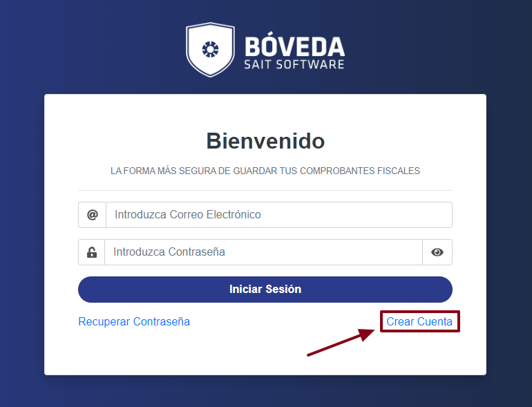
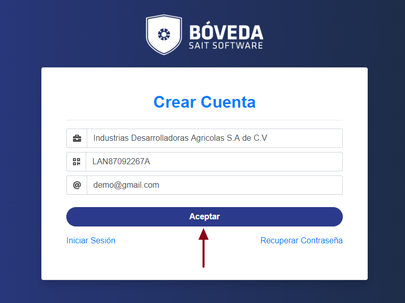
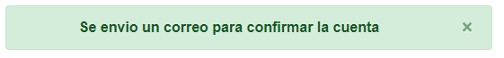
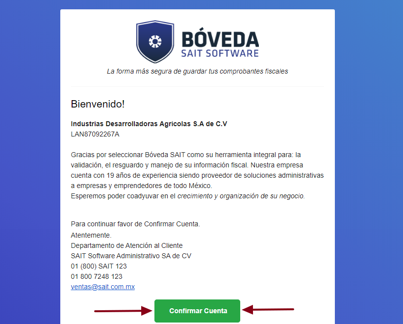
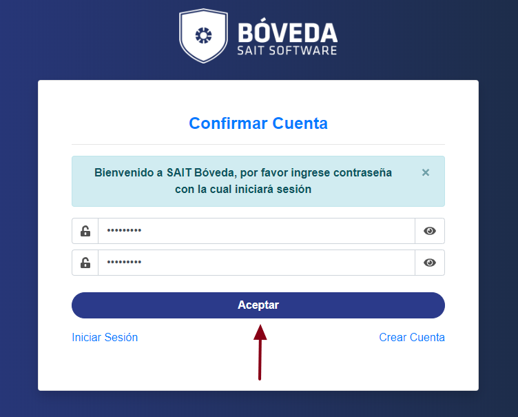
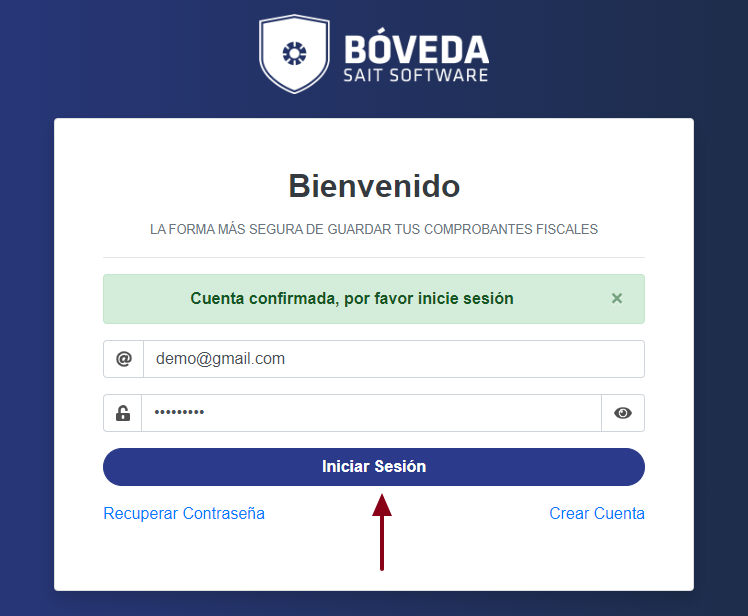
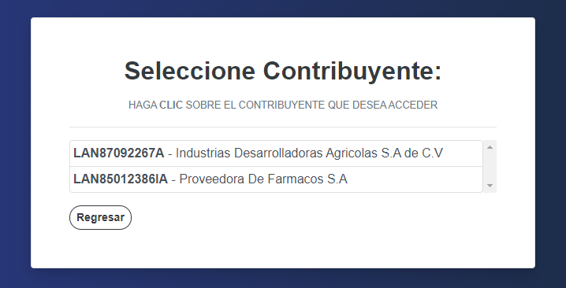
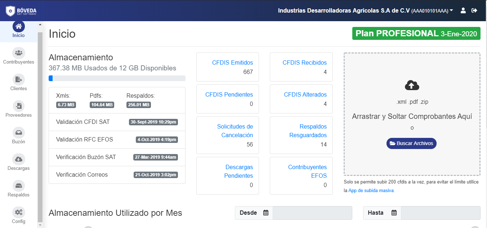

#### ° Acceder a la pagina SAIT Bóveda.

Lo primero que abra que hacer es dirigirse a   **http://boveda.sait.mx/app/#/login**.
Ya una vez estando dentro de la pagina dar clic en el enlace **Crear Cuenta**.

 

#### ° Creación de la cuenta.
Se presentara la pantalla de registro, en la cual se tendra que rellenar los datos requeridos para la correcta creación de la cuenta, ya una vez rellenado dichos datos se tendra que precionar el boton de **Aceptar**

 

Se le dará la notificación de que revise su correo electrónico para **confirmar cuenta**.
 

#### ° Comprobar y confirmar entrega de correo electronico.
El siguiente paso sera dirigirse al correo electronico puesto anteriormente. Ya estando dentro del correo electronico abra recibido un email de SAIT Bóveda en donde tendra que dar un **click** para abrir dicho email.

ya una vez dentro del **email** aparecera una carta de bienvenida, dentro de dicha carta se tendra que dar **clic** al boton de **Confirmar cuenta**.

 

#### ° Confirmación de nueva contraseña.
 Se le redirigirá a una pagina en la que se debe ingresar una nueva contraseña. Ya una vez elegido la contraseña darle **clic** al boton de **Aceptar** para confirmar su cuenta.
 
 

 Ya confirmada su cuenta podrá **iniciar sesión**.

 

#### ° Selección de contribuyente.
 Al iniciar sesión si cuenta con más de una empresa registrada en **SAIT Bóveda** aparecera un menú en donde se tendra que elegir la empresa en la cual quiere ingresar.

 

De lo contrario si es la unica cuenta registrada en **SAIT Bóveda** Se le redirigirá directamente a la pantalla principal de **Bóveda SAIT**

 > **NOTA:** Una cuenta de correo puede tener acceso a varias empresas diferentes.

