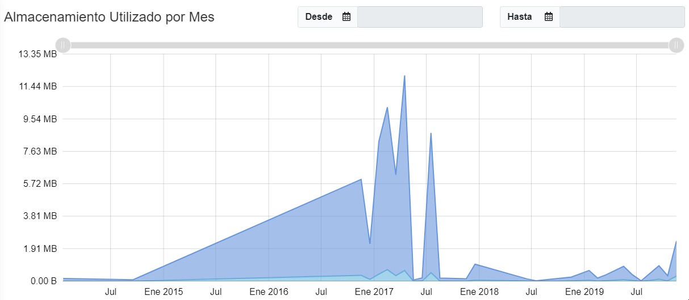

### ° Almacenamiento

Para acceder al inicio de **SAIT bóveda** dar clic en el ícono de **Inicio**.

dentro de la sección de **Inicio** se encontrara la información de **Almacenamiento**
En esta sección te encontraras con la capacidad de almacenamiento disponible donde te indica **cuanta memoria se consumió** y cuanta **memoria libre queda disponible.** 

Tambien se muestra una tabla en donde te indica en que fue **utilizada la memoria consumida.** 

#### ° Almacenamiento Utilizado por Mes.

 Se muestra una grafica en donde se puede visualizar el **formato** de almacenado tanto como la **cantidad** de dicho formato  y el **espacio de almacenamiento** que ocupo almacenar dicho(s) formato(s) de cada mes del año.

Tambien puedes elegir un rango de fechas para visualizar el almacenamiento que se utilizo en **dichos meses.**

### ° Validaciones

En la siguiente tabla se muetran los diferentes tipos de validaciones, mostrando la fecha en la que se **realizo la ultima validación** de cada una de las validaciones.

* Validación CFDI SAT
 * Fecha en la que se realizó la última validación del estatus de los CFDIS.  
* Validación RFC EFOS
 * Fecha en la que se realizó la última validación de los contribuyentes EFOS.  
* Verificación Buzón SAT
 *  Fecha en la que se realizó la última verificación de las solicitudes de cancelación al buzón tributario.  
* Verificación Correos
 * Fecha en la que se realizó la última verificación de CFDIS en los correos. 

### ° Estado de CFDIS.

En esta sección podras ver el **total de todos los CFDIS** tanto como **emitidos** como **resividos** entre otros mostrados a contianución:

* CFDI emitidos
 * CFDI emitidos a Clientes.
* CFDIS Recibidos
 * CFDI recibidos de proveedores.
* CFDIS Pendientes
 * Pendientes de validación ante el SAT.
* CFDIS Alterados
 * CFDI no pasan validaciones de autenticidad.
* Solicitudes de Cancelación
 * CFDI no pasan validaciones de autenticidad.
* Respaldos Resguardados
 * CFDI no pasan validaciones de autenticidad.
* Descargas Pendientes
 * Descargas solicitadas al SAT pendientes.
* Contribuyentes EFOS
 * Empresas que Factura Operaciones Simuladas y/o Inexistentes.

### ° Subida de CFDIS

En esta sección podras subir **CFDIS** a tu **SAIT Bóveda**
arrastrando y soltando los comprobantes en el area permitida o buscandolos directamente presionando el boton de **Buscar archivos**.

>Solo se permite subir 200 cfdis a la vez, para evitar el límite utilice la 
<a href="http://sait.mx/download/saituploader.exe">App de subida masiva.</a>
