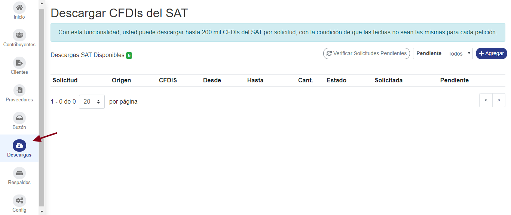
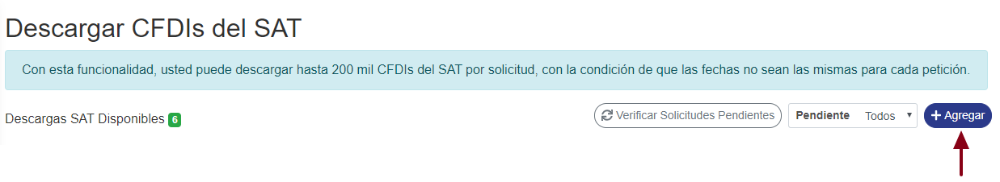
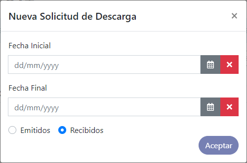
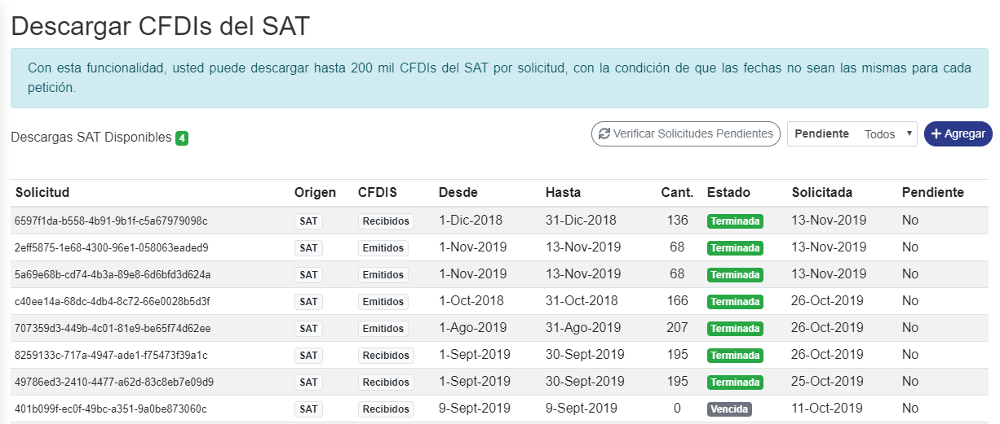

**Es un requisito tener registrados sus certificados en SAIT Bóveda**

#### ° Sección de descargas 

* Para ello diríjase a la sección de **Descargas** donde podrá ver el listado de solicitudes de descarga pendientes.

#### ° Realizar nueva solicitud.

Para hacer una solicitud de descarga de **clic** en el botón **agregar.**

Aparecerá una ventana donde debe seleccionar los parámetros para descarga.

Seleccione el intervalo de fechas para la descarga y si serán emitidos o recibidos. 

> El estado de la solicitud de descarga cambiara conforme a lo que responda el SAT, cuando se procese de manera automática se agregaran los comprobantes a la Bóveda.

