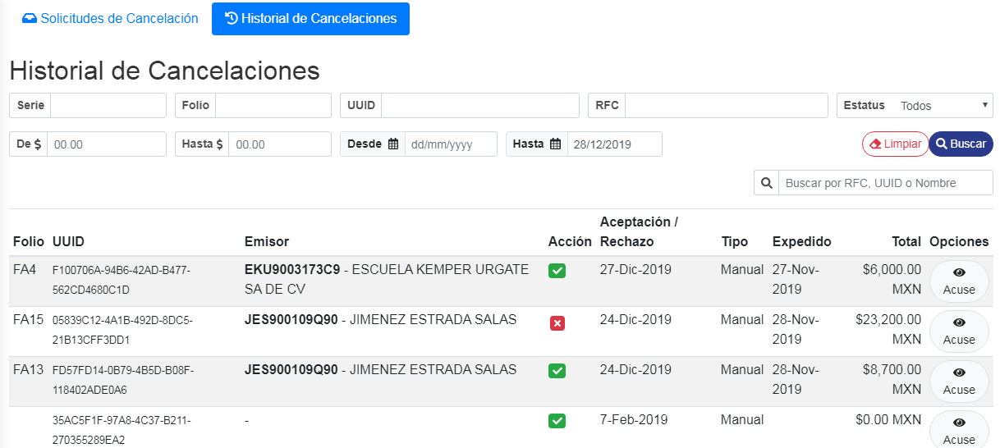

> **NOTA: si no se muestran todos lo datos de la solicitud, es porque no se encuentra ese comprobante en provedores (recibidos).**

### ° Acciones realizadas

En la tabla inferior se mostraran todas las **solicitudes que fueron aceptadas o rechazadas**, mostrando su **acción** con una palomita verde, indicando que tal **solicitud fue aceptada.**

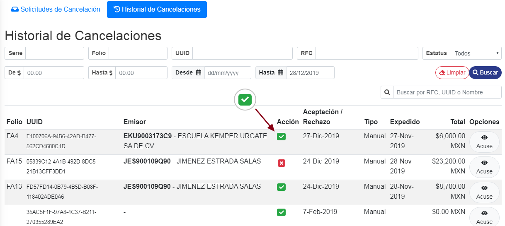

o mostrando su **acción** con una tacha roja, indicano que tal **solicitud fue rechazada.**

En la tabla inferior se mostraran el **Tipo**, este campo indicara si la solicitud fue **aceptada/rechazada** de manera manual o si el buzón inteligente fue el que se encargo de **aceptarla o rechazarla**.

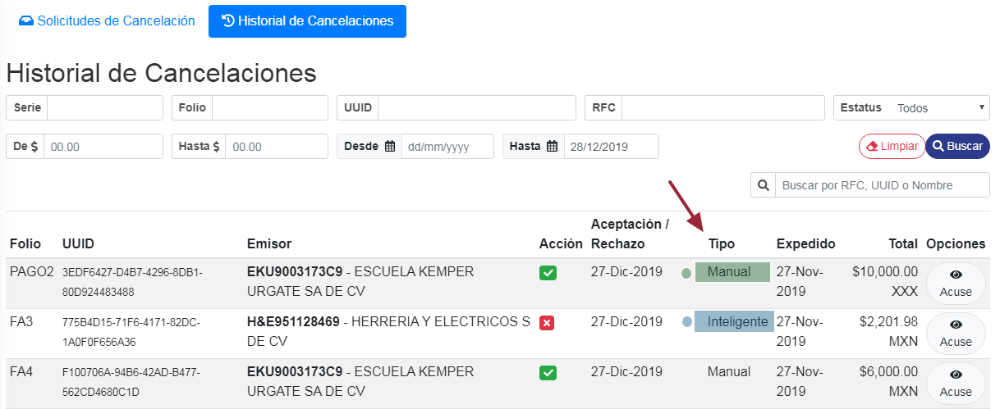

### ° Descargar Acuse

Para descargar el acuse de cualquier **Solicitud**, dar **clic** en el boton de **Acuse** en la solicitud que deseé descargar.

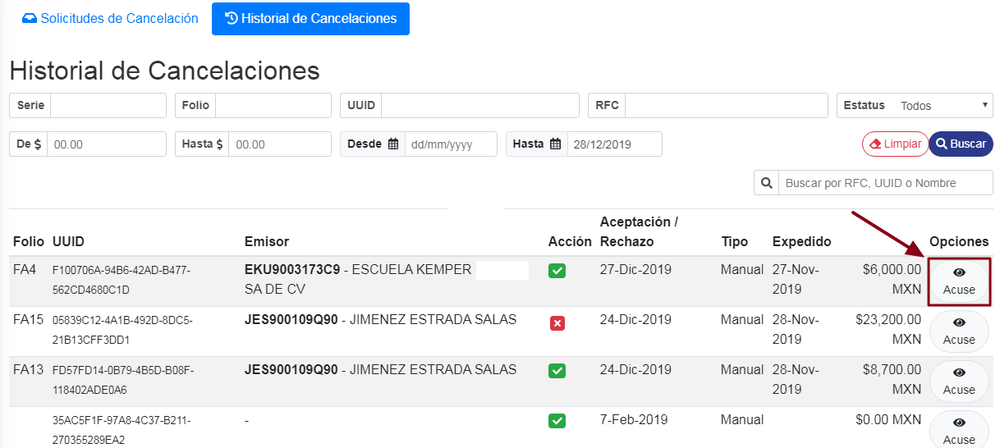

Se visualizara el acuse el cual estara en **formato PDF**, por lo tanto podra descargar dicho acuse como normalmente descarga archivos **PDF**.

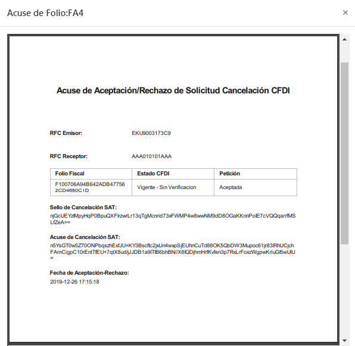

### ° Tipos de busqueda

Se podran buscar las **solicitudes de cancelación** en el historial de cancelaciónes por **:**
* **Serie**
* **Folio**
* **UUID**
* **RFC**
* **Estatus**
* **Rango de monto**
* **Rango de fechas**
* **Busqueda libre**

> **NOTA: Todas los tipos de busquedas mostrados a continuación se utilizara el mismo boton para limpar cualquier busqueda seleccionada.**

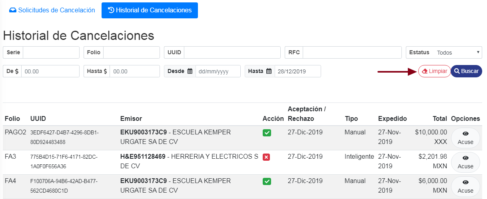

Para buscar cualquier **solicitud de cancelación** que ya fue **aceptada o rechazada** por su **serie**, teclear sobre el campo con dicho nombre la seria de la solicitud a buscar y precionar el boton de **Buscar**.

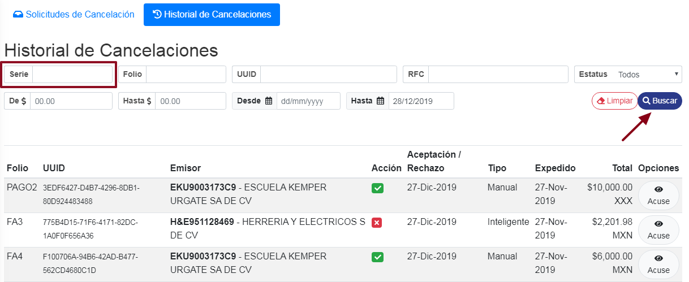

Para buscar cualquier **solicitud de cancelación** que ya fue **aceptada o rechazada** por su **Folio**, teclear sobre el campo con dicho nombre el folio de la solicitud a buscar y precionar el boton de **Buscar**.

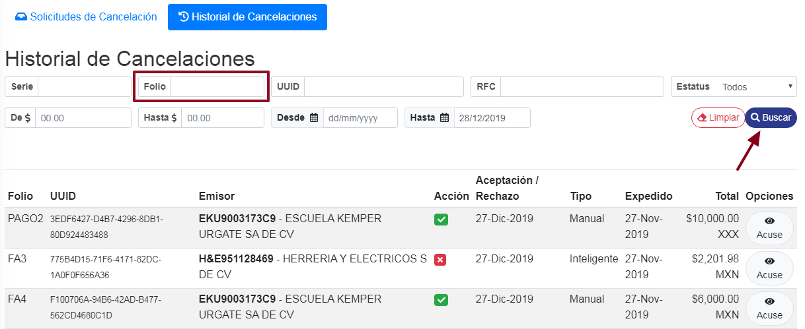

Para buscar cualquier **solicitud de cancelación** que ya fue **aceptada o rechazada** por su **UUID**, teclear sobre el campo con dicho nombre el UUID de la solicitud a buscar y precionar el boton de **Buscar**.

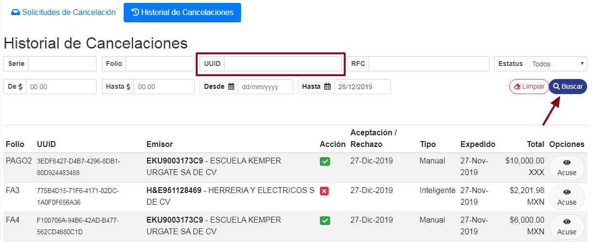

Para buscar cualquier **solicitud de cancelación** que ya fue **aceptada o rechazada** por su **RFC**, teclear sobre el campo con dicho nombre el RFC de la solicitud a buscar y precionar el boton de **Buscar**.

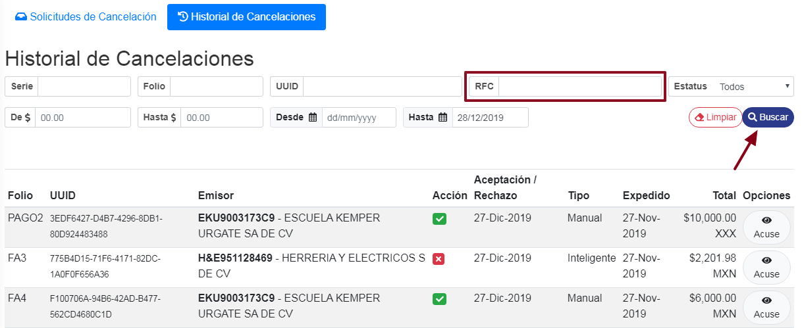

Para buscar por **Rango de monto** alguna solicitud de cancelación, teclear el monto mínimo sobre el campo **De $** y el monto maximo sobre el campo **Hasta $** y dar clic al boton de **Buscar** para realizar la busqueda.

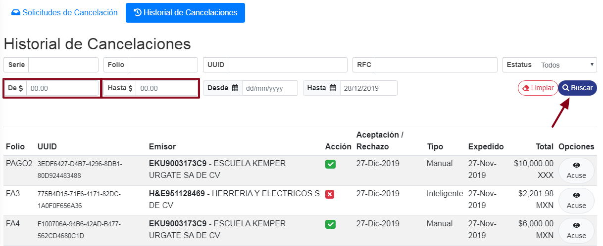

Para buscar por **Rango de fecha** alguna solicitud de cancelación, teclear la fecha inicial sobre el campo **Desde** y la fecha final sobre el campo **Hasta** y dar clic al boton de **Buscar** para realizar la busqueda.

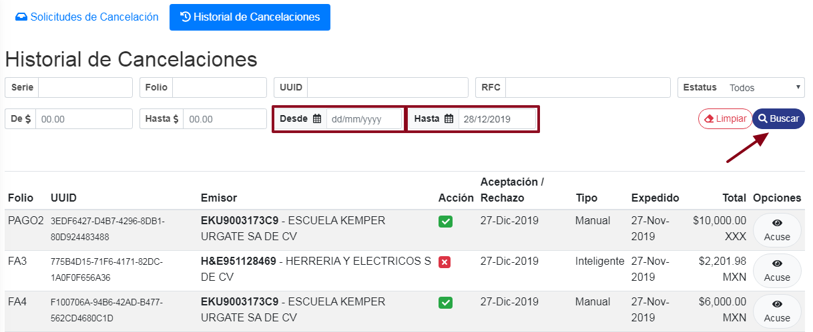

Para buscar por **Estatus** alguna solicitud, dar **clic** al campo de **Estatus**, se despliegara una lista con los siguientes estatus:

* **Todos**
* **Pendientes**
* **Aceptadas**
* **Rechazadas**

Seleccionar el que sea de su necesidad y dar clic al boton de **Buscar**.

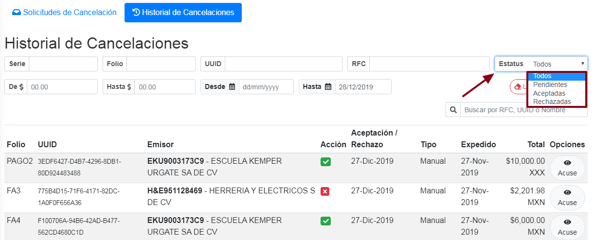

Para realizar una busqueda libre, teclear el **UUID**,**RFC** o **Nombre del contribuyente** en el campo mostrado a continuación, de esta manera se buscaran los datos a tiempo real mientras se teclea la busqueda.

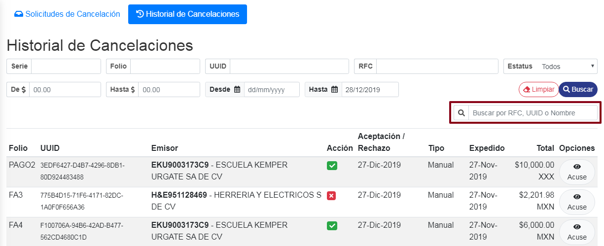