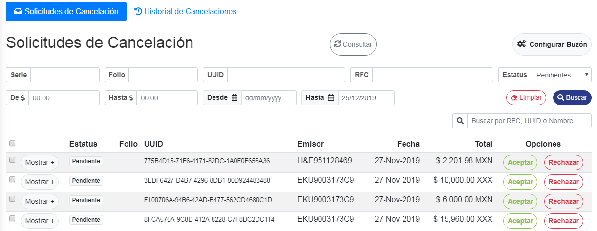
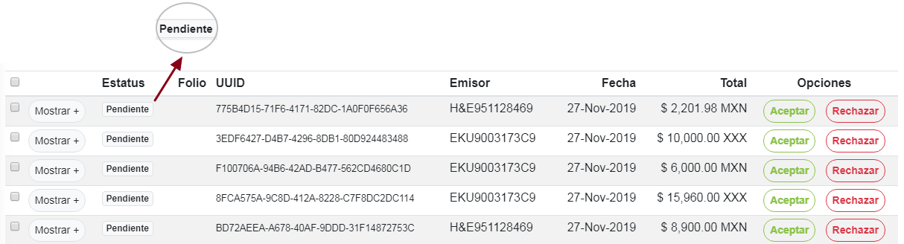
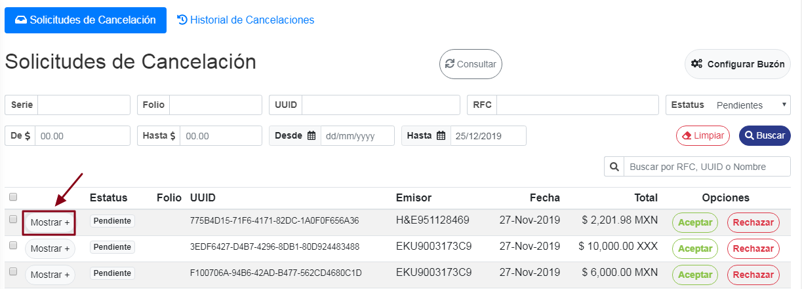
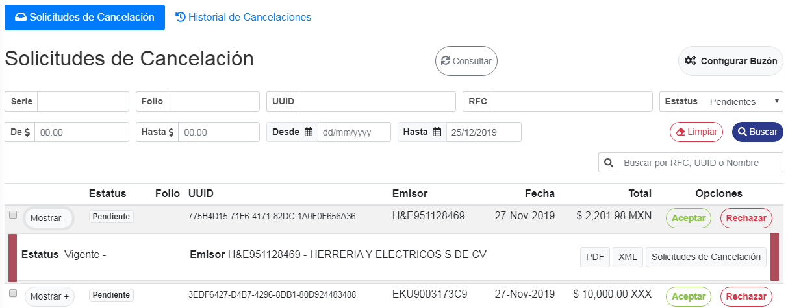
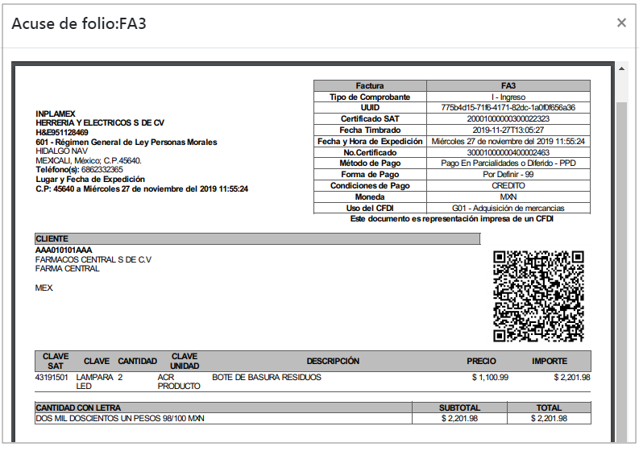
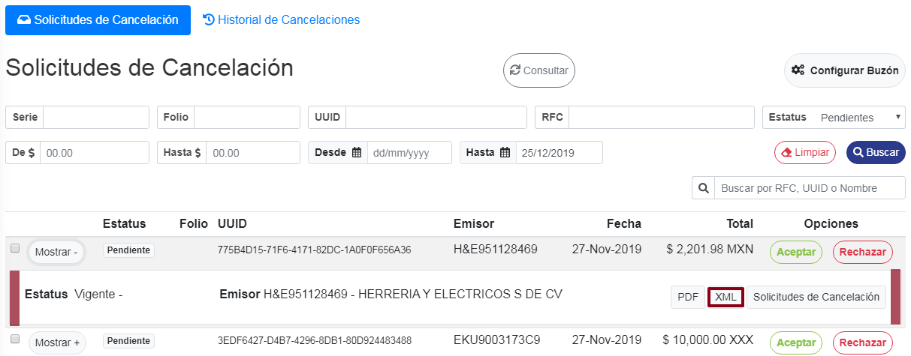
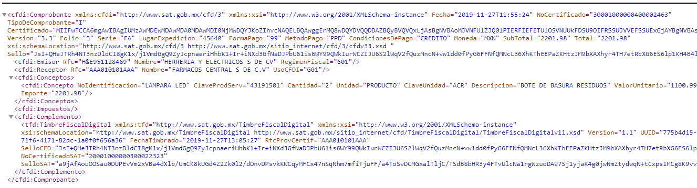

### ° Estatus de solicitud

En la tabla inferior se mostraran todas las **solicitudes de cancelación**, mostrando su estado en **pendiente** si es que no se han aceptado o rechazado.

### ° Ver detalles de solicitudes

Se podran ver más a detalle las solicitudes de cancelación dando **clic** al boton de **mostrar** en la solicitud deseada.

Se desplegara un pequeño menú en donde se visualizaran los datos de la solicitud, tanto como su estatus de vigencia, el emisor de la solicitud y los diferentes formatos de descarga.

### ° Descargar Acuse de folio

Para visualizar y descargar algun **Acuse de folio** en formato **PDF**, dar **clic** en el boton de **PDF** de cualquier solicitud en la que se desea descargar el **Acuse**.

Se visualizara el acuse el cual estara en formato **PDF**, por lo tanto podra descargar dicho acuse como normalmente descarga archivos PDF.

### ° Visualizar en XML

Para visualizar algun **Acuse de folio** en formato **XML**, dar **clic** en el boton de **XML** de cualquier solicitud en la que se desea visualizar dicho formato.

Se visualizara la factura en formato **XML** en el navegador que se tenga asignado por defecto.

