### ° Estatus de solicitud

En la tabla inferior se mostraran todas las **solicitudes de cancelación**, mostrando su estado en **pendiente** si es que no se han aceptado o rechazado.

### ° Ver detalles de solicitudes

Se podran ver más a detalle las solicitudes de cancelación dando **clic** al boton de **mostrar** en la solicitud deseada.

Se desplegara un pequeño menú en donde se visualizaran los datos de la solicitud, tanto como su estatus de vigencia, el emisor de la solicitud y los diferentes formatos de descarga.

### ° Descargar Acuse de folio

Para visualizar y descargar algun **Acuse de folio** en formato **PDF**, dar **clic** en el boton de **PDF** de cualquier solicitud en la que se desea descargar el **Acuse**.

Se visualizara el acuse el cual estara en formato **PDF**, por lo tanto podra descargar dicho acuse como normalmente descarga archivos PDF.

### ° Visualizar en XML

Para visualizar algun **Acuse de folio** en formato **XML**, dar **clic** en el boton de **XML** de cualquier solicitud en la que se desea visualizar dicho formato.

Se visualizara la factura en formato **XML** en el navegador que se tenga asignado por defecto.

### ° Aceptar solicitud de cancelación

Para aceptar alguna **solicitud de cancelación**, dar **clic** en el boton de **Aceptar** en la solicitud que se desea aceptar.

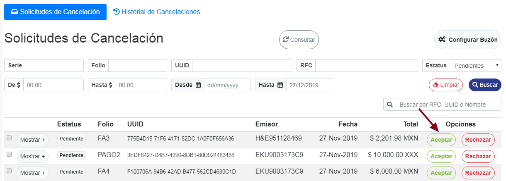

Se mostrara una ventana de confirmación, en la cual se pedira la **Confirmación de Aceptación de Solicitud**.

Para aceptar la **Confirmación de Aceptación de Solicitud**, dar **clic** al boton de **Sí**, de esta manera se aceptara dicha solicitud de cancelación.

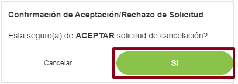

Para cancelar la **Confirmación de Aceptación de Solicitud**, dar **clic** al boton de **Cancelar**, de esta manera se cancelara el proceso de confirmación de la solicitud.

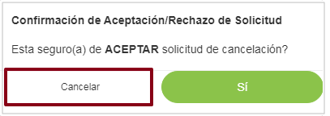

### ° Rechazar solicitud de cancelación

Para rechazar alguna **solicitud de cancelación**, dar **clic** en el boton de **rechazar** en la solicitud que se desea rechazar.

Se mostrara una ventana de confirmación, en la cual se pedira la **Confirmación de rechazo de Solicitud**.

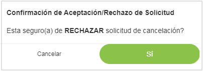

Para aceptar la **Confirmación de rechazo de Solicitud**, dar **clic** al boton de **Sí**, de esta manera se rechazara dicha solicitud de cancelación.

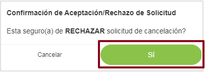

Para cancelar la **Confirmación de rechazo de Solicitud**, dar **clic** al boton de **Cancelar**, de esta manera se cancelara el proceso de confirmación de rechazo de la solicitud.

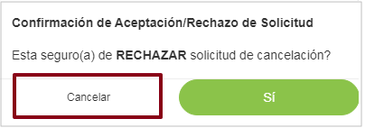

### ° Seleccionar varias solicitudes de cancelación.

Para seleccionar varias Solicitudes de Cancelación, dar **clic** en la pequeña casilla que se muestra del lado izquierdo del boton de **Mostrar**, de esta manera se podran seleccionar asta un total de 5 casillas a la vez.

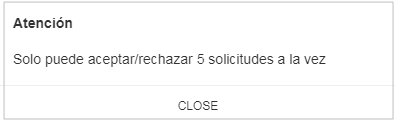

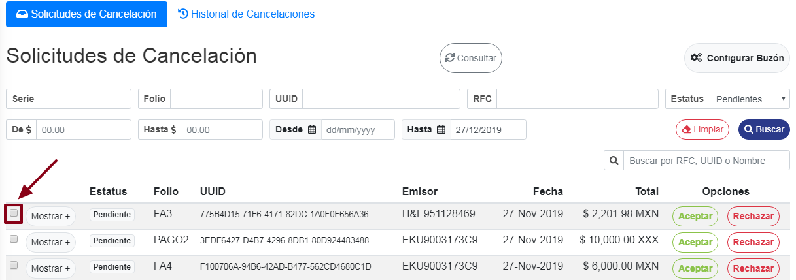

al seleccionar la(s) casilla(s) se mostraran dos botones, uno sera para **Aceptar solicitudes seleccionadas** y el otro boton sera para **Cancelar las solicitudes seleccionadas**.
 
 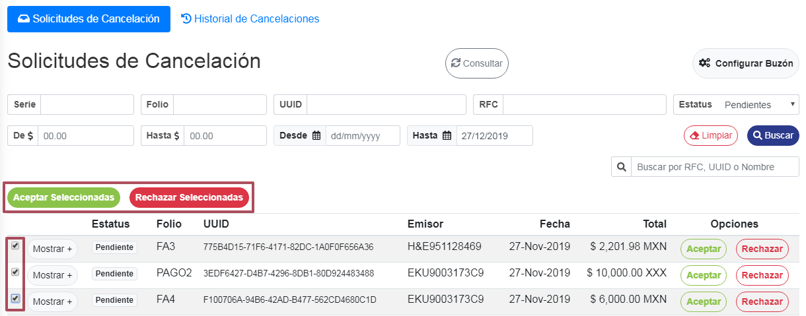

### ° Tipos de busqueda
Se podran buscar las **solicitudes de cancelación** por **:**
* **Serie**
* **Folio**
* **UUID**
* **RFC**
* **Estatus**
* **Rango de monto**
* **Rango de fechas**
* **Busqueda libre**

> **NOTA: Todas los tipos de busquedas mostrados a continuación se utilizara el mismo boton para limpar cualquier busqueda seleccionada.**

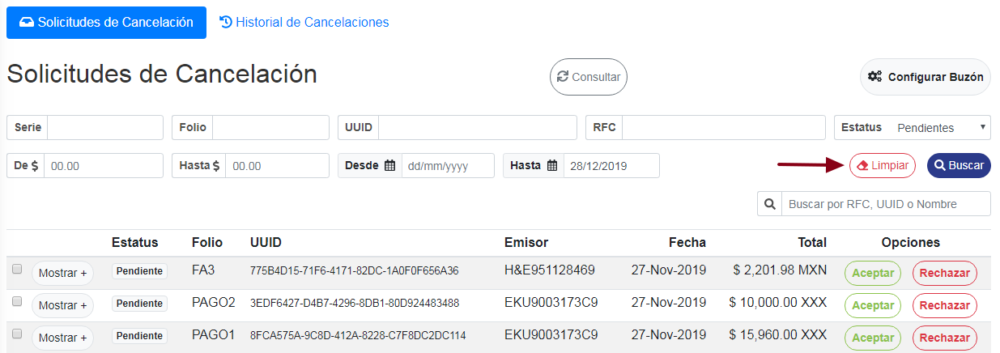

Para buscar por **serie** alguna solicitud de cancelación, teclear la **serie**** sobre el campo con dicho nombre y dar clic al boton de **Buscar** para realizar la busqueda. 

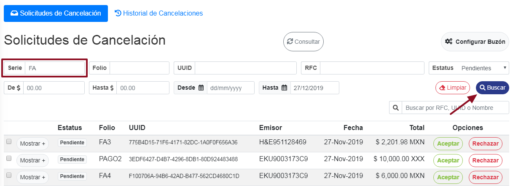

Para buscar por **Folio** alguna solicitud de cancelación, teclear el **folio** sobre el campo con dicho nombre y dar clic al boton de **Buscar** para realizar la busqueda. 

Para buscar por **UUID** alguna solicitud de cancelación, teclear el **UUID** sobre el campo con dicho nombre y dar clic al boton de **Buscar** para realizar la busqueda. 

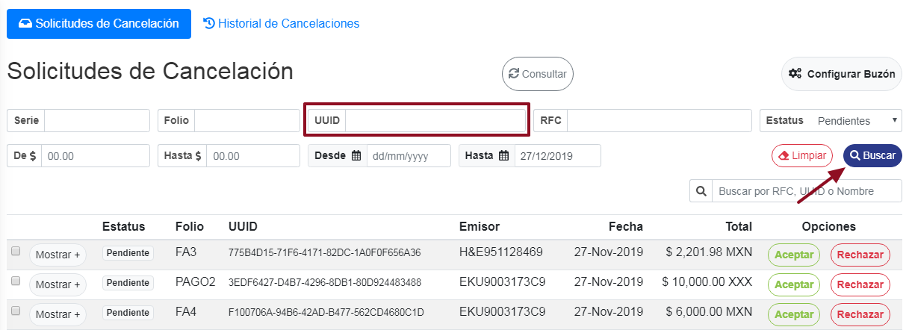

Para buscar por **RFC** alguna solicitud de cancelación, teclear el **RFC** sobre el campo con dicho nombre y dar clic al boton de **Buscar** para realizar la busqueda. 

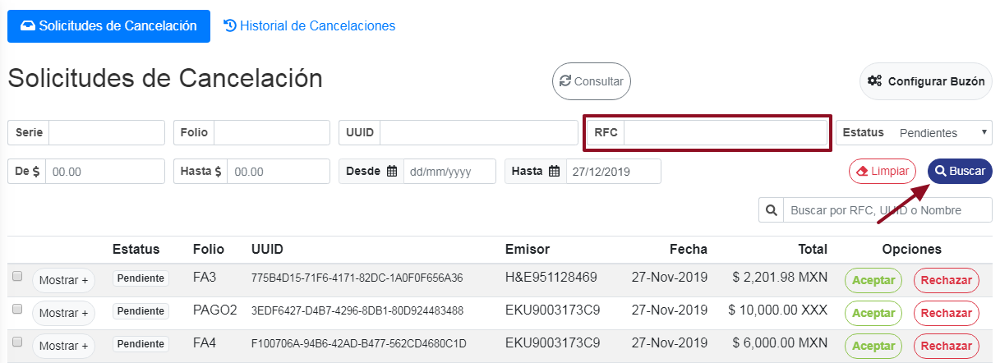

Para buscar por **Rango de monto** alguna solicitud de cancelación, teclear el **monto mínimo** sobre el campo **De $** y el **monto maximo** sobre el campo **Hasta $** y dar clic al boton de **Buscar** para realizar la busqueda. 

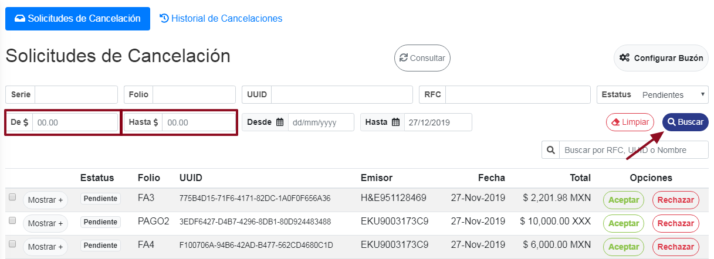

Para buscar por **Rango de fechas** alguna solicitud de cancelación, teclear la **fecha inicial** sobre el campo **Desde** y la **Fecha final** sobre el campo **Hasta** y dar clic al boton de **Buscar** para realizar la busqueda. 

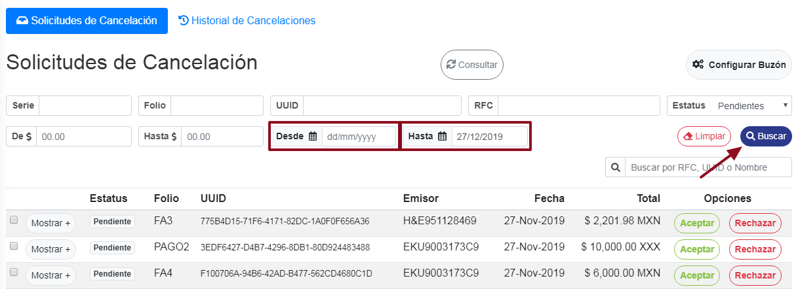

Para buscar por **Estatus** alguna solicitud de cancelación, dar **clic** al campo de **Estatus**, se despliegara una lista con los siguientes estatus:

* **Todos**
* **Pendientes**
* **Aceptadas**
* **Rechazadas**

Seleccionar el que sea de su necesidad y dar clic al boton de **Buscar**.

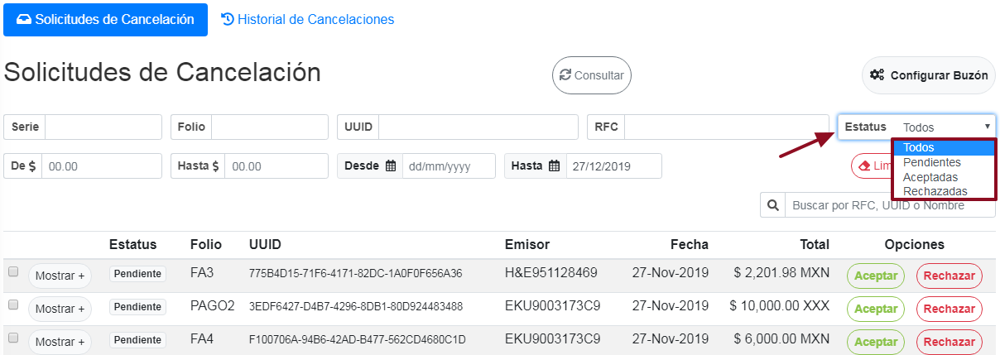

Para realizar una busqueda libre, teclear el **UUID**,**RFC** o **Nombre del contribuyente** en el campo mostrado a continuación, de esta manera se buscaran los datos a tiempo real mientras se teclea la busqueda.

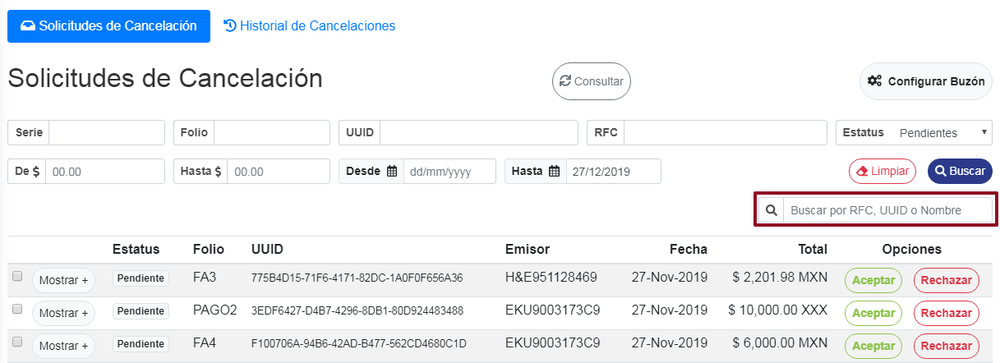

### ° Actualizar solicitudes de Cancelación

Para actualizar las solicitudes de cancelación y así mostrar las nuevas solicitudes que se tienen pendientes, dar **clic** al boton de **Consultar**, de esta manera se actualizara y mostrar las nuevas solicitudes de cancelación.

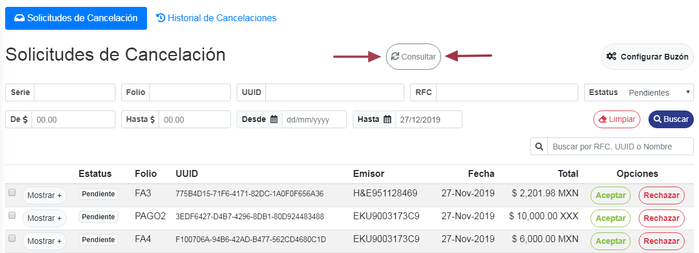

### ° Configuración de buzón

Para configurar el buzón inteligente y asi tener un control de que facturas son las que entraran en **solicitudes de Cancelación**, dar clic en el boton de **Configurar buzón**.

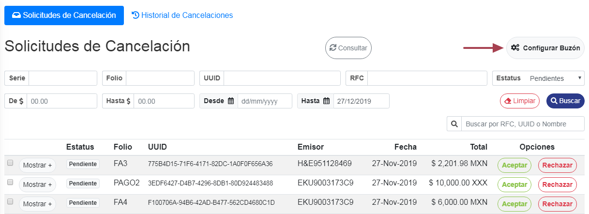

Te redireccionará a la sección de **Buzon inteligente** en donde se podra activar o desactivar el rechazo automático de CFDIS de Cancelación, así como establecer reglas para cancelar de forma automática.

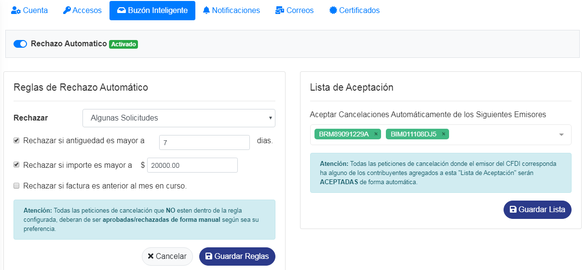
